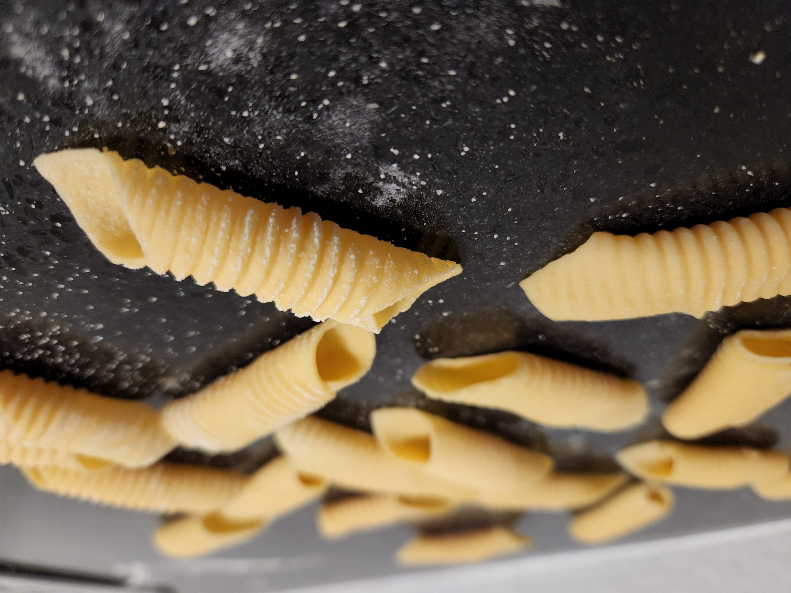
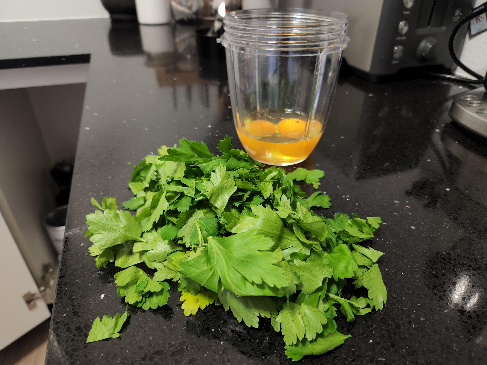
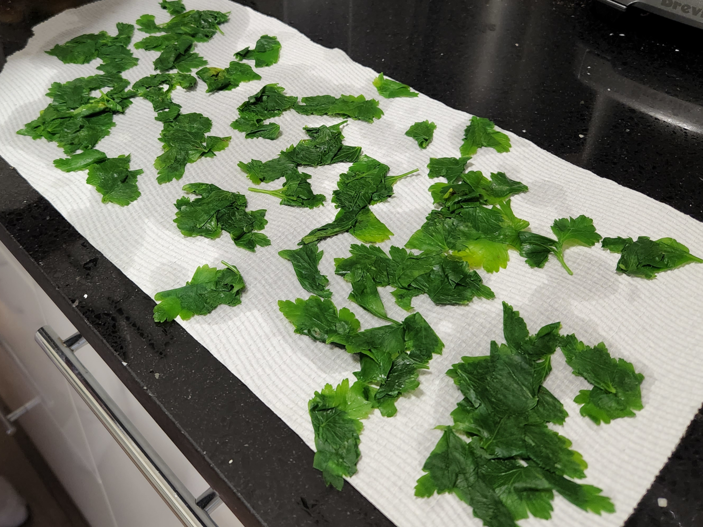
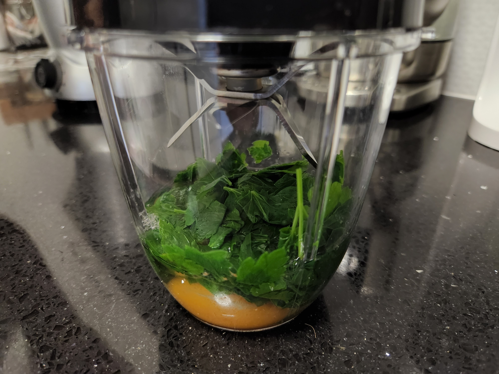
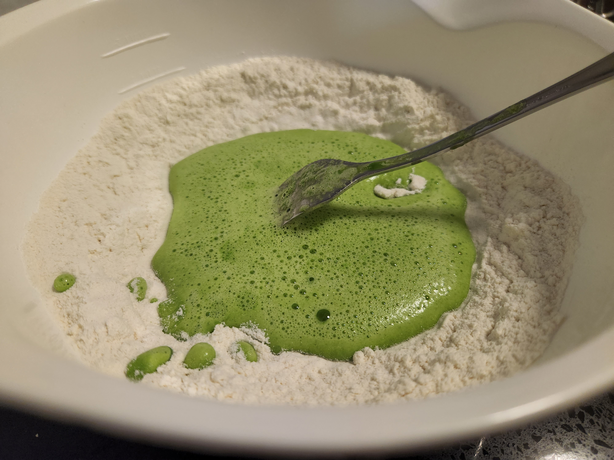
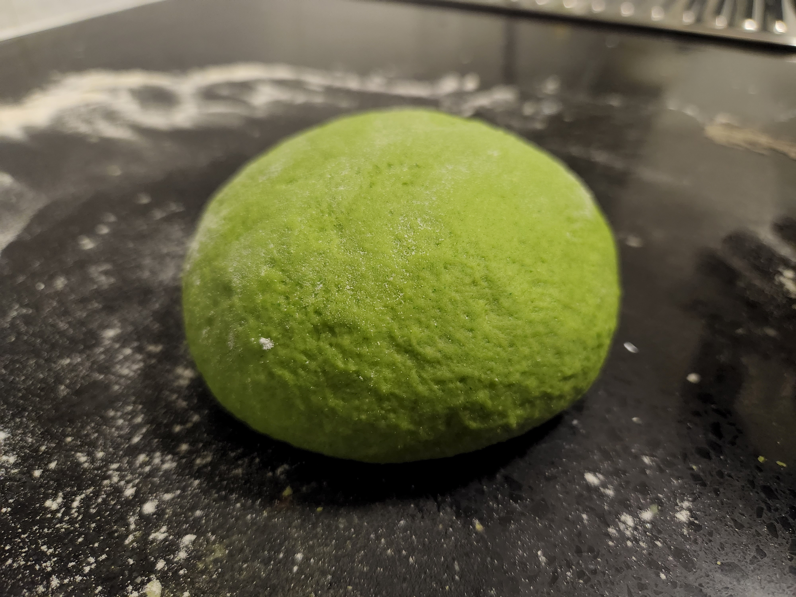
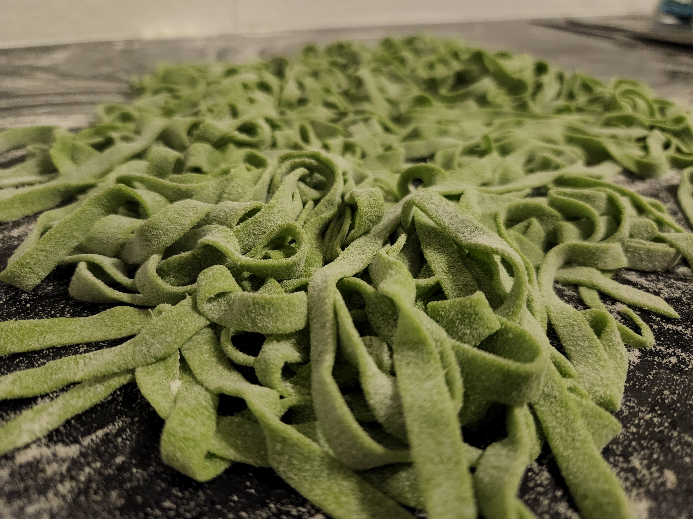

### Egg Pasta Dough

| Ingredient | Amount |
| ----- | ----- |
| Flour |  90g 00 & 10g Semolina |
| Egg |  1 |
| Salt |  2g |
| Water | Splash |

>These ratios are per person. Double it for two people and so on.


  
  
  


 

### Method

Add salt into a mixing bowl and then the flour. Make a well in the centre; crack in the egg(s) and add an ammount of water. Mix to bring it together.

Turn the mixture out onto the bench and kneed to combine adding more flour as you go so it doesn't stick to the bench or more water if it's not smooth enough. Continue to kneed for 5-10mins to get same consistancy thoughout making long strokes with your palm to develop the gluten.

Form the dough into a ball, it should be smooth and spring back when you poke it. Dust with flour and wrap in glad wrap to rest for ~30mins.

You're ready to roll it out and create your desired shape.

### Semolina Pasta Dough

| Ingredient | Amount |
| ----- | ----- |
| Flour |  125g 00 & 125g Semolina |
| Salt |  4-5g |
| Water (warm) | 110g-125g |

>Ratios are for 2 people.  Same method as above. Just kneed it thoroughly and use warm water to give it some life. Semolina is high in protein so it naturally wants to form a strong gluten network. Tearing the dough is less important here.

### Green Pasta

Gather some parsley and blanch in boiling water, from the kettle will do. Dry it out and blend together with the eggs and continue with the process above.
 

  
  
  
  
  
  

 

