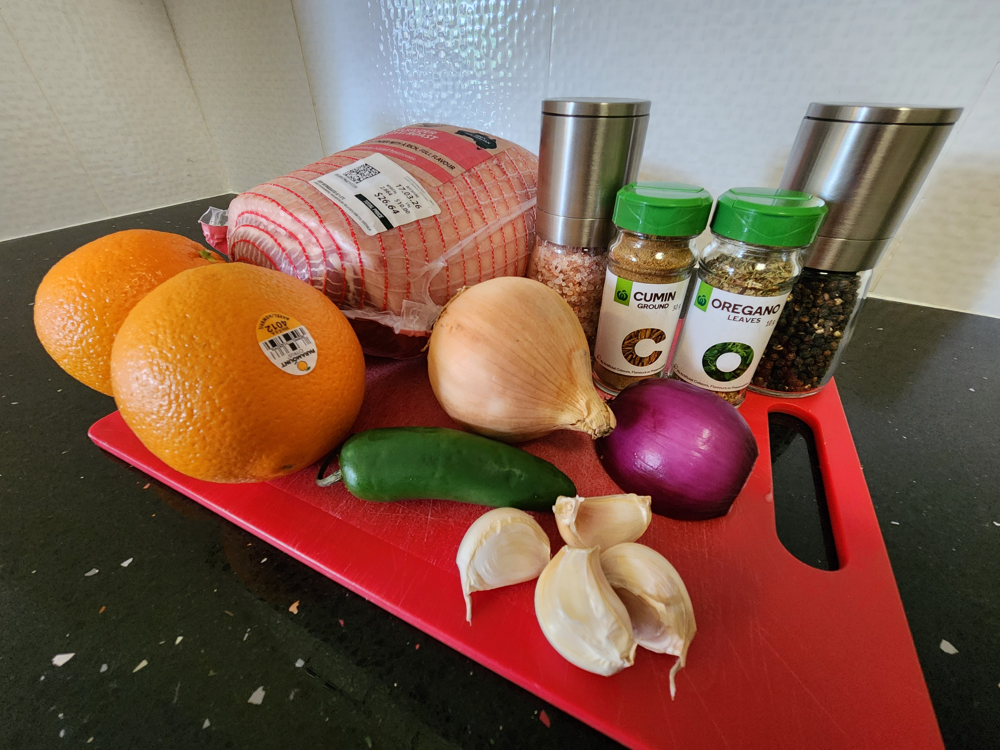
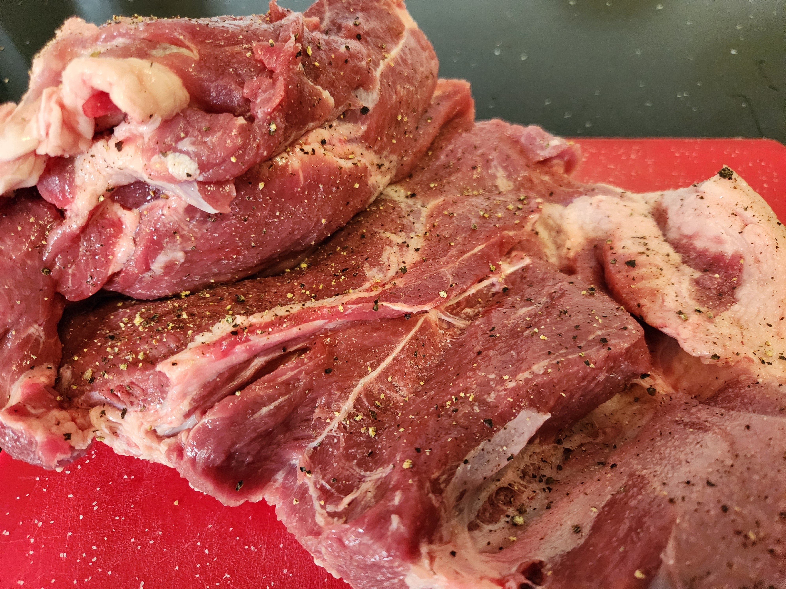
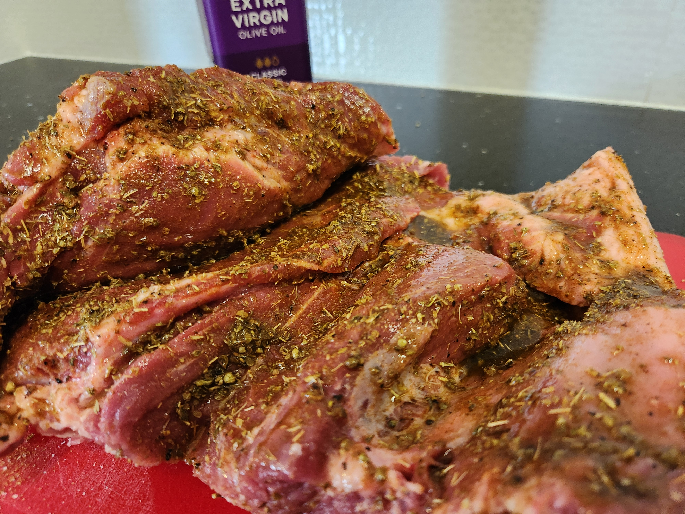
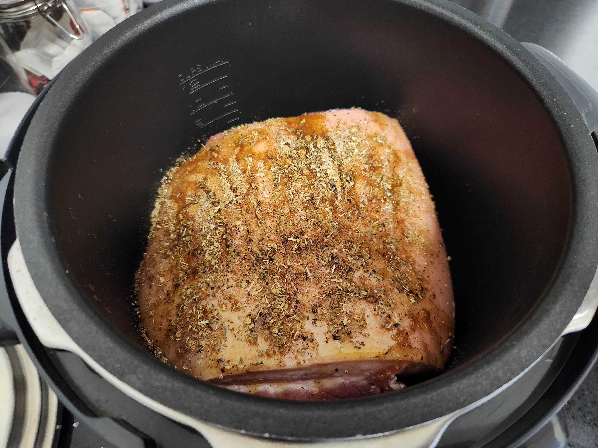
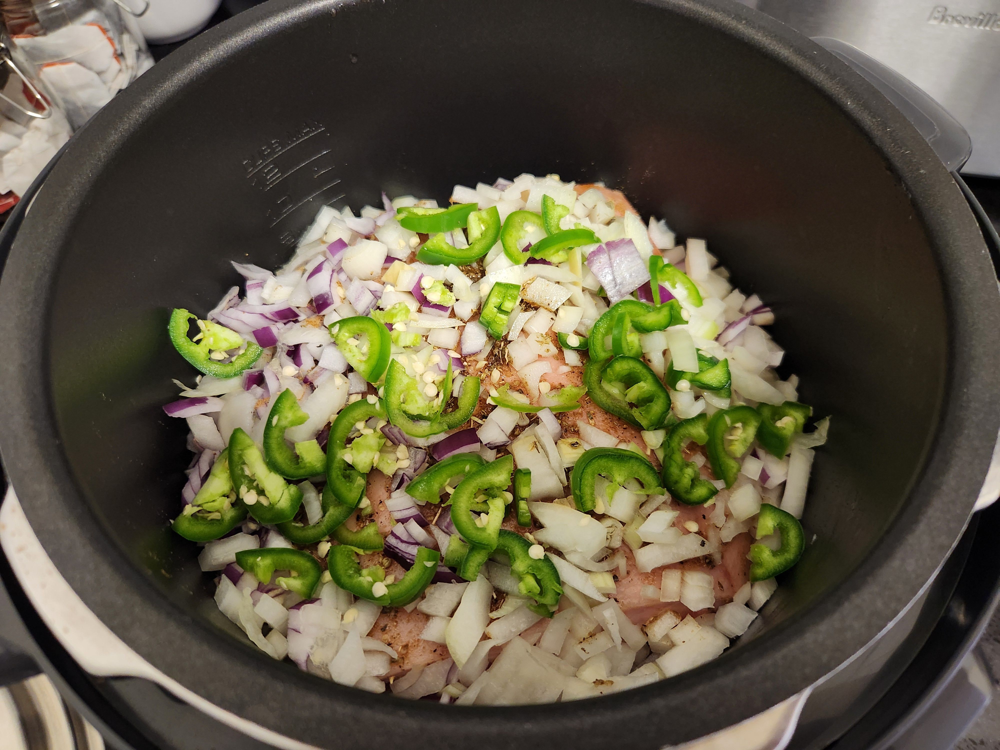
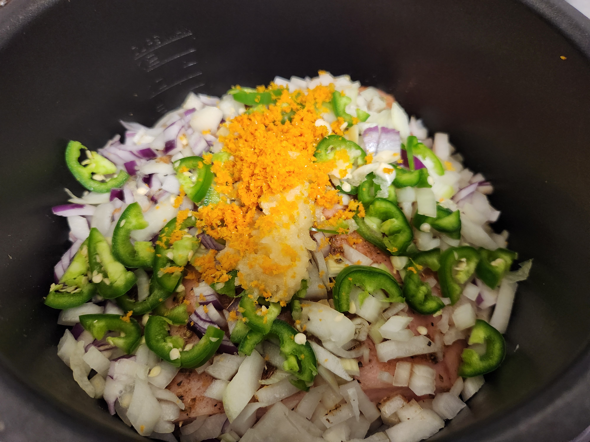
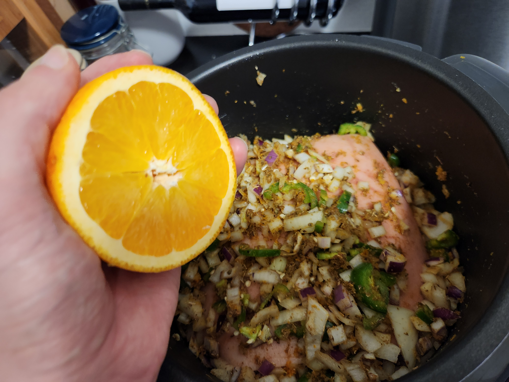
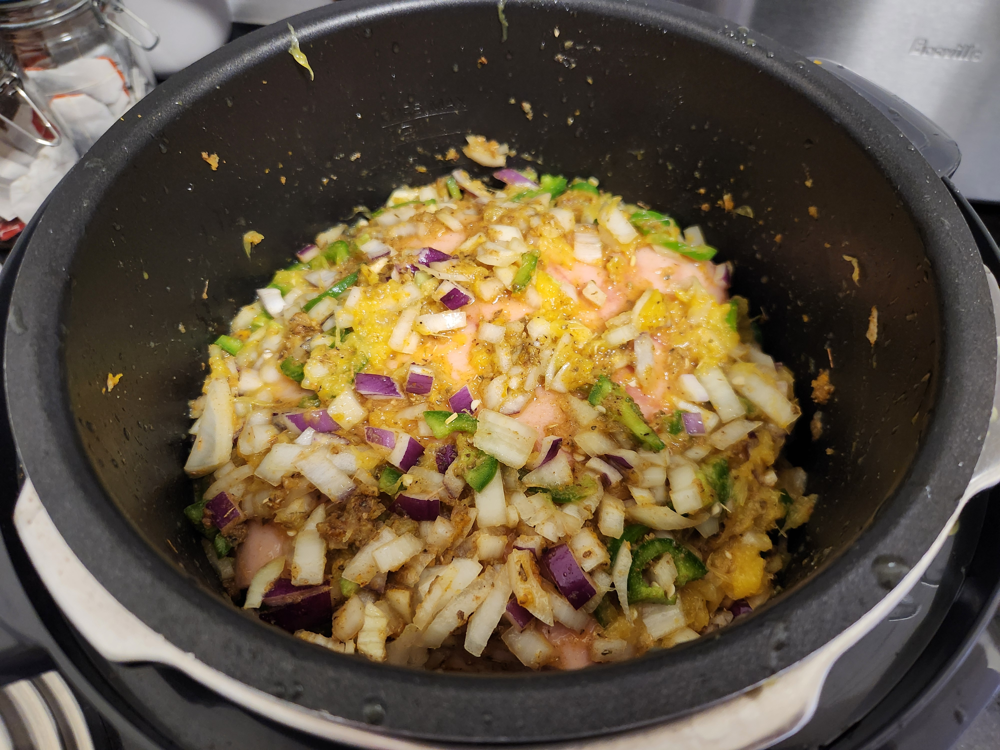
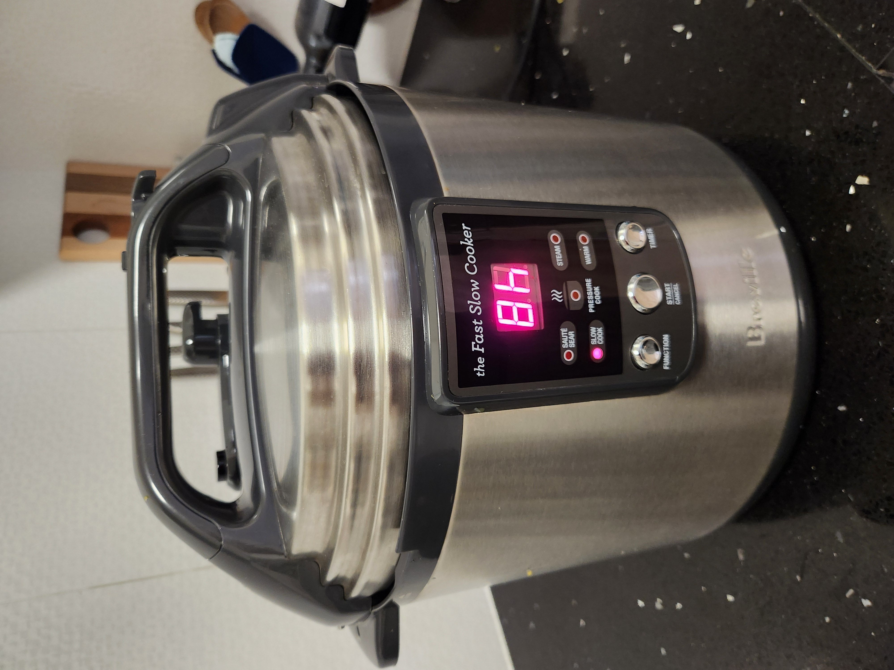
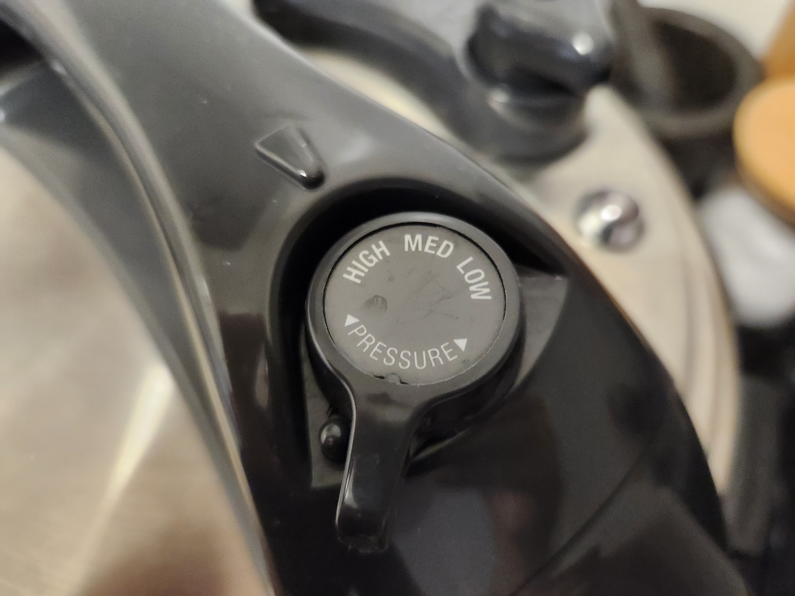

| Ingredient | Ammount |
| ----- | ----- |
| Pork Shoulder | ~2.6-3kg  |
| Salt | to season |
| Pepper | to season |
| Olive Oil | to combine |
| Dried Oregano | ~2tbsp |
| Cumin | ~2tbsp |
| Garlic | 4 large cloves |
| Onion | 1-1.5 |
| Jalapeno |  1 |
| Orange |  2 |


  


 

# Method

- Unwrap the pork shoulder and drain any blood. Roll it out skin side down and season with salt & pepper then cumin & oregano. Cover with enough olive oil and massage the mix into the meat getting it into all the hard to reach places.


  
  
  


- Roll the pork shoulder back together and place into the slow cooker fat cap up.

- Season the top with the herbs and spices and then add the chopped onion and jalapeno.


  
  


- Microplane the garlic and orange zest onto the onion and mix all the herbs, spices, onion, garlic and zest together.

- Then juice the oranges over it all. Don't worry if any pulp gets in there just no seeds.


  
  
  


- Close the slow cooker up and set to slow cook for 8hrs on high. It only needs 7hrs though (programed choice is 6hrs or 8hrs).


  
  


> Start prepping at ~10:30am to get this on at 11am to finish cooking by 6pm

- After time, take the pork out and let it cool for a minute.

- Set the slow cooker to sear and reduce the liquid in there for ~15-20mins. Enough to mix in with the pork but not have it swimming. 

- Pull the pork. Discard the fat cap. Return the pulled pork to the slow cooker and combine with the reduced liquid.

- Portion the pork to be bagged and frozen for later or for the cast iron pan for tonights dinner.
> 300g portions of meat, not counting additional leftover liquid after 
> 2.664kg shoulder made 6 meals for two

 


Next time:  
- Jalapeno went in seeds and all. Consider 1/2 seeded or fully deseeding if it's too much considering adobo sauce is part of the base taco recipe 
- Season the onion rather than the fat cap just to make sure the flavour is getting into the right ingredients 
- Check how many cm of liquid the slow cooker to help get the right juiciness 
