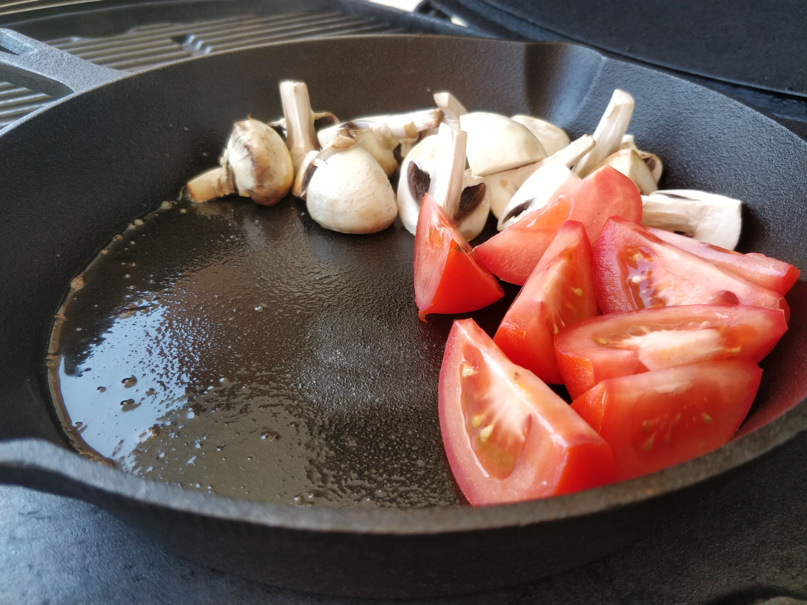
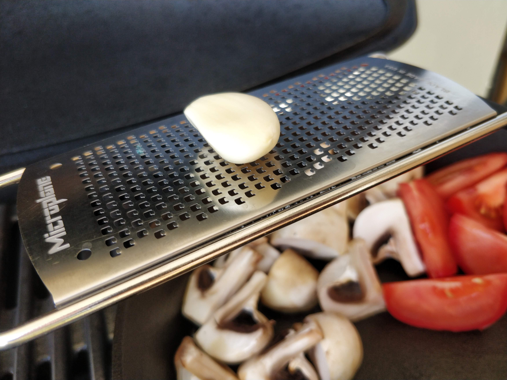
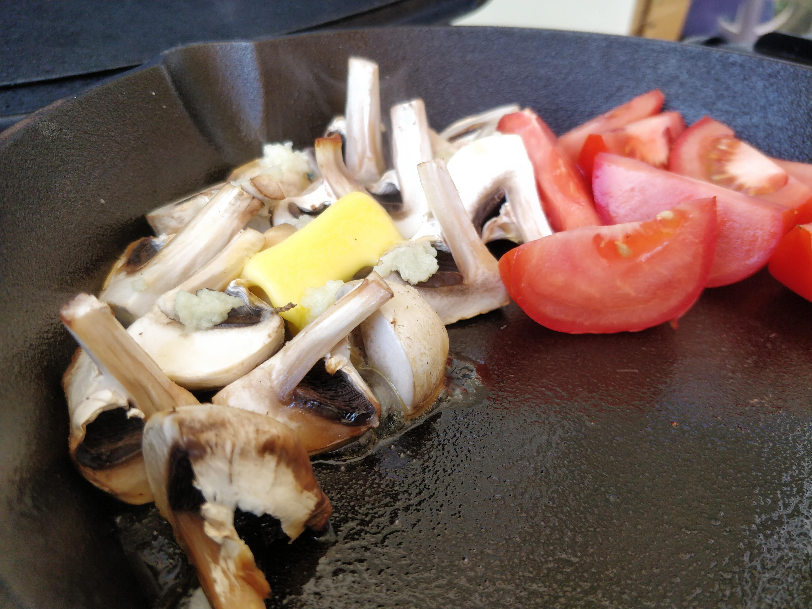
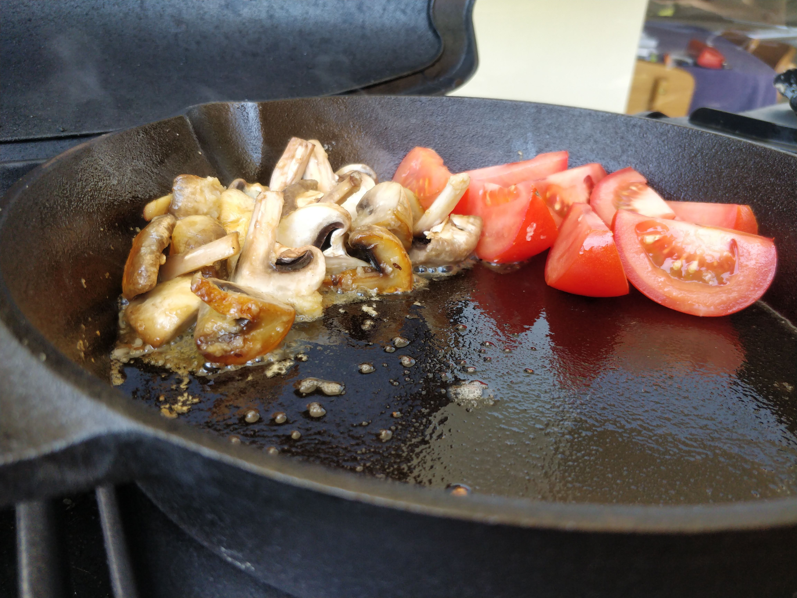
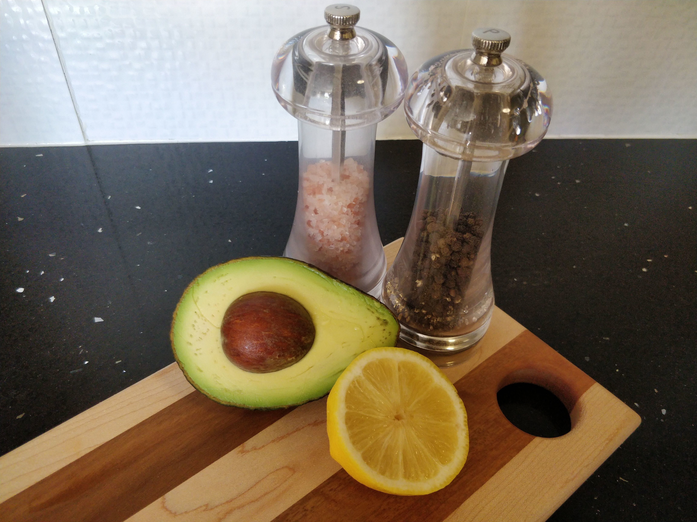
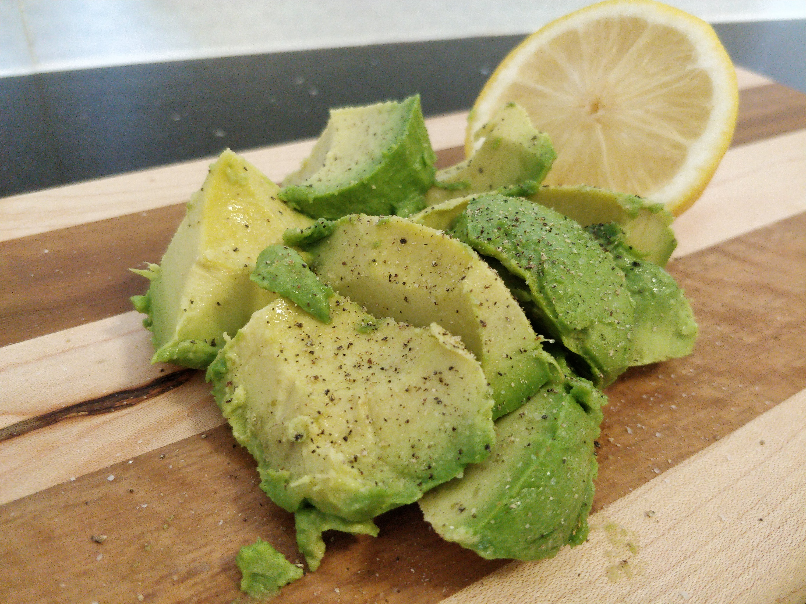
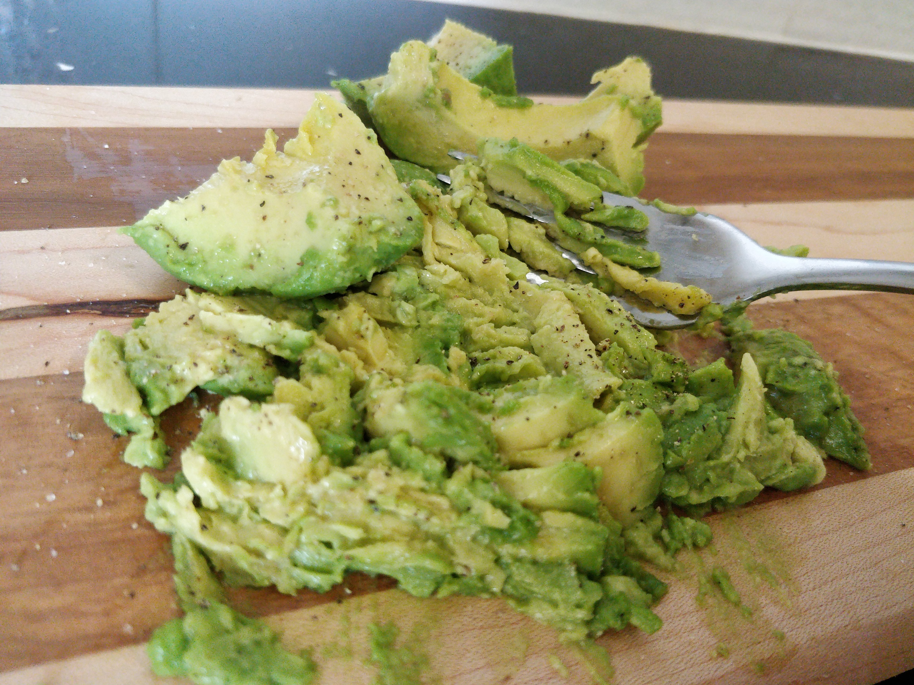
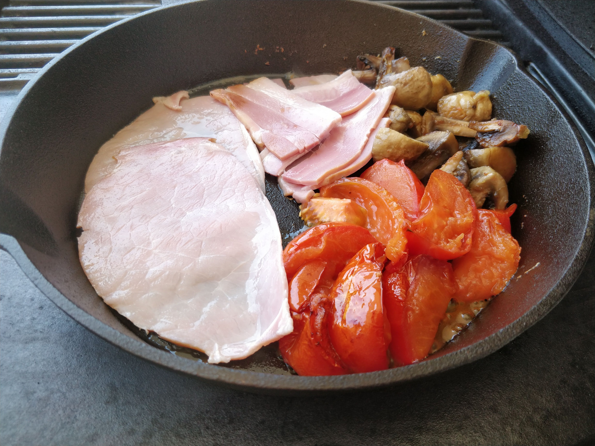
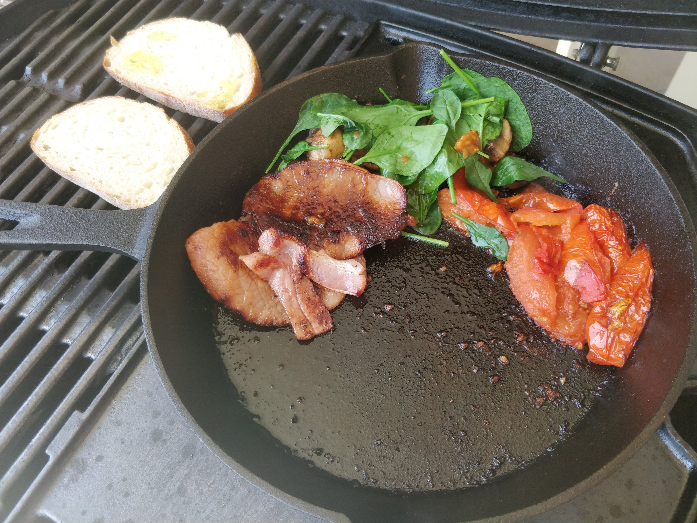
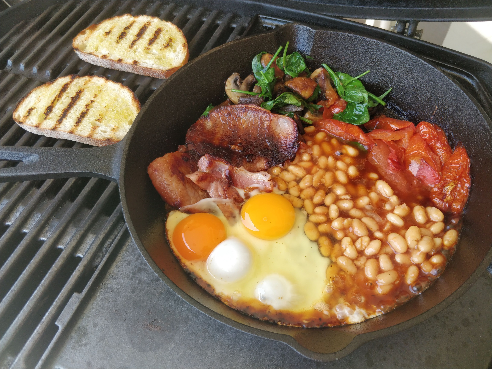

Break this out on a weekend to set you up for the day. The bright pockets of acidity from the lemon in the avo and tang/sweetness of the tomatoes contrasts with the meatyness of the bacon & egg, garlic mushrooms and baked beans. Has the heart of a classic Full English with the soul of Australia.

| Ingredient  | Amount |
| ----- | ---- |
| Bacon | 2 rashers |
| Egg | 2 |
| Mushroom | 5 white cup |
| Garlic | 1 clove |
| Butter | 10-20g |
| Spinach | 1 small handful |
| Tomato | 1 large or 5 cherry |
| Avocado | 1/2 |
| Lemon | to squeeze |
| Heinz Baked Beans | 1 lil one |
| Sourdough | 2 slices |
| Salt |
| Peper |
| Olive Oil |



## Method

Heat a cast iron skillet on the BBQ and add a thin layer of butter to coat the pan. Cut the mushrooms into quaters and the tomato down and add them to the pan. Microplane garlic over the mushrooms and add enough butter to them so they're coated.

>If you already have garlic butter then add a knob of that


  
  
  
  


 
While the mushrooms and tomatoes cook down prepare the avocado. Scoop out the flesh and use a fork to smash it up, season with salt and pepper and add a squeeze of lemon.


  
  
  


 
Add bacon and let it cook for a while rotating the pieces around to coat them with the fat that has rendered out into the pan. Once the bacon is almost there drizzle olive oil on the sourdough and place on the grill to toast and toss the spinich into the mushrooms.

Baked beans go in and then crack the eggs in last. Let them cook for a few minutes.


  
  
  


 
Salt and pepper on the eggs to finish. Serve up and enjoy.



>Pro Tip: The cast iron pan will keep the meal hot but you risk overcooking the eggs if you leave them in there for too long
