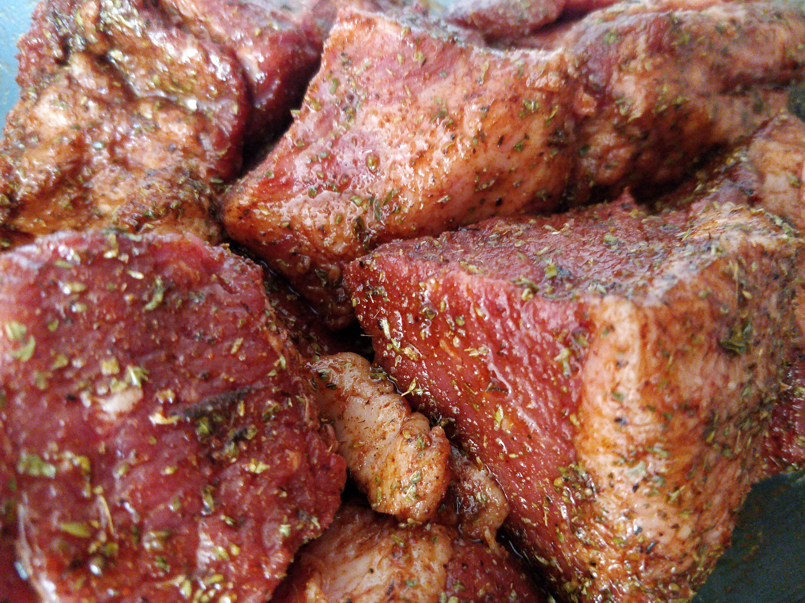
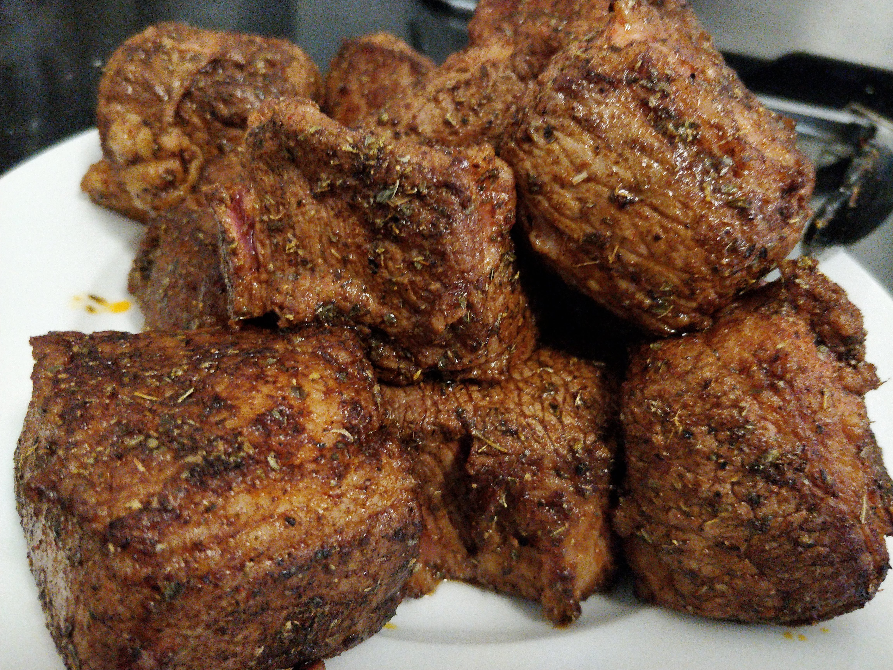
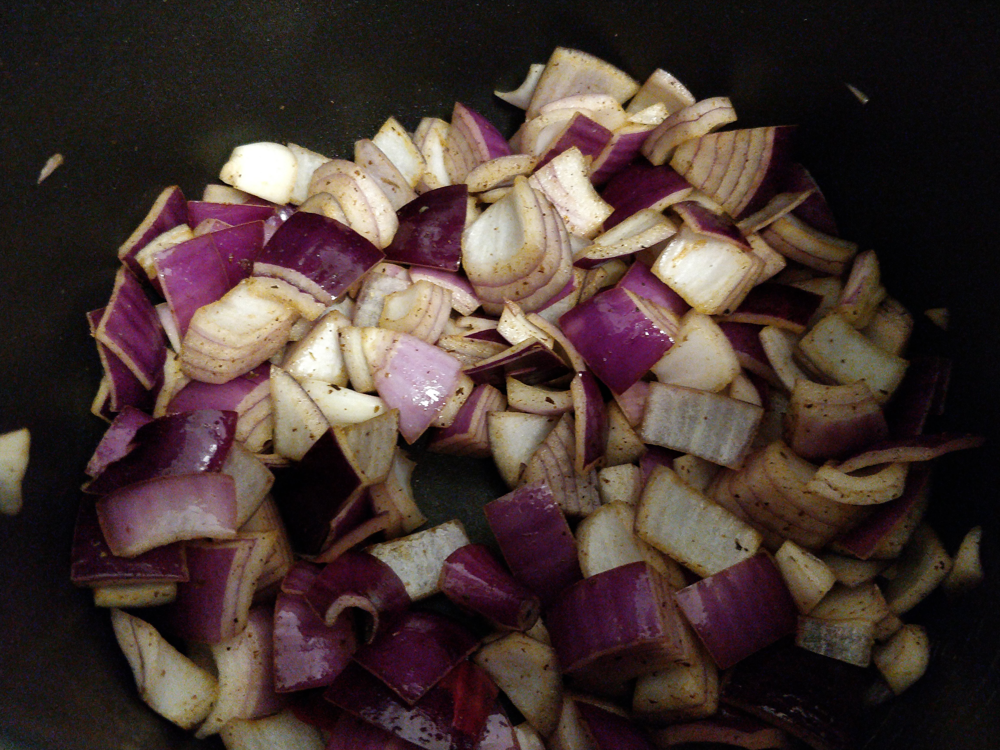
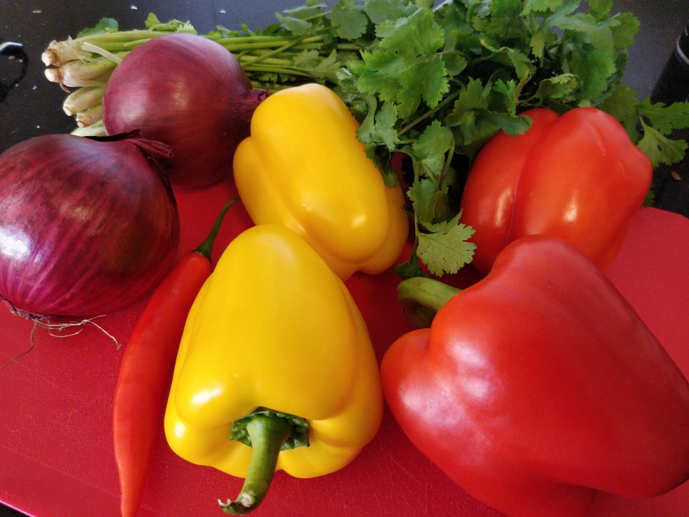
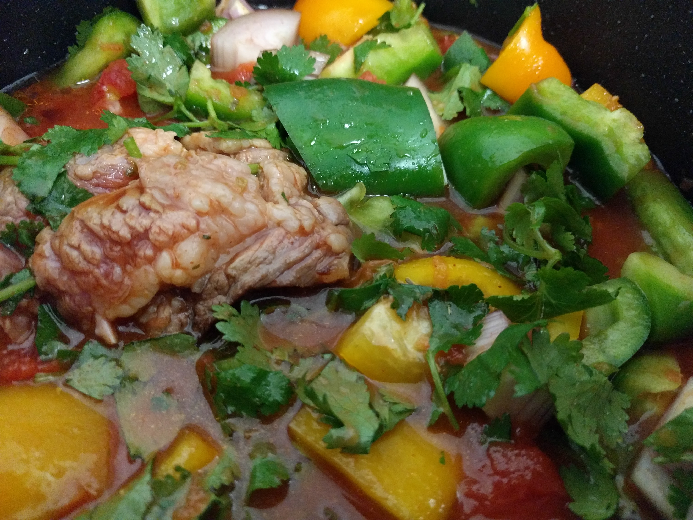


Skip to Method


| Ingredient  | Amount |
| ----- | ---- |
| Beef Brisket | 1.5-2kg |
| Cinnamon | 1 teaspoon |
| Cumin | 1 tablespoon |
| Smoked Paprika | 1 tablespoon |
| Oregano | 1.5 tablespoons |
| Olive Oil |  |
| Fresh Bay Leaf | 2 |
| Red Capcicum | 2 |
| Yellow Capcicum | 2 |
| Tomatos Crushed/Pulped | 2 x 400g tins |
| Beef Stock | 400ml |
| Red Chilis | 3 |
| Red Onion | 2 |
| Corriander Roots | 1 bunch |
| Red wine vinegar | did not do this |



## Method
### Pepare Brisket

Cut up the brisket into managable pieces. Season with spices and sear off in the slowcooker


  
  
  


### Soften the onions

Cut up the onions and chuck em in the slowcooker and roll them all around the beef/spice oil and cook them down until they soften.
 

  

  

Now add all the other things and mix and put on slowcook for 5hrs

 

  
  


### Pull

Pull the beef and reduce the sauce for almost 1-1.5hrs (so stock pot gell pod may be worthwhile)

Add any cornstarch and slide the pulled beef back in there. Stir so it doesn't catch on the bottom the slowcooker as it is really hot on full sear. May want to pop it on hold to control the heat from getting to much.
  
Bag and tag
 

This recipe makes 9 packs


 

Next time you make this: 
Less Liquid or simmer uncovered (it takes almost an hour to reduce in the slow cooker & ~1/4cup of cornflour was added 
Also add in 2 cans black beans to the ingredients

