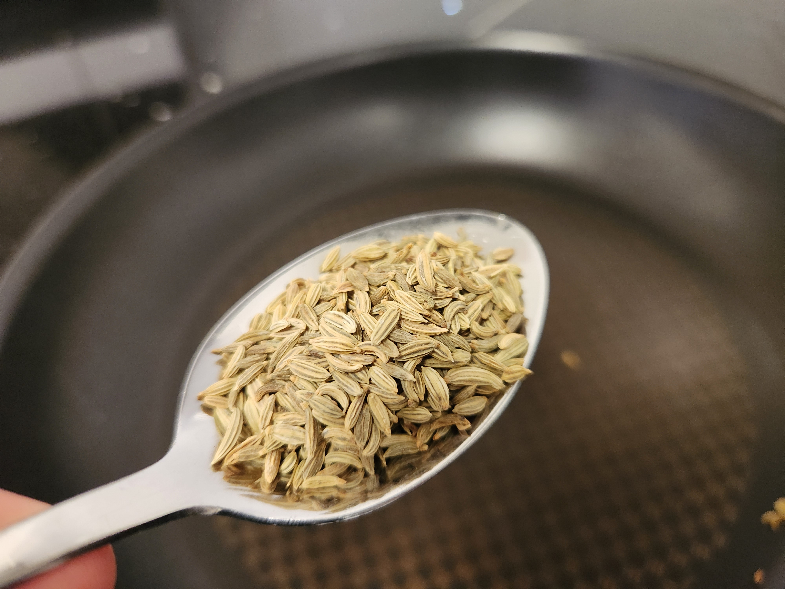
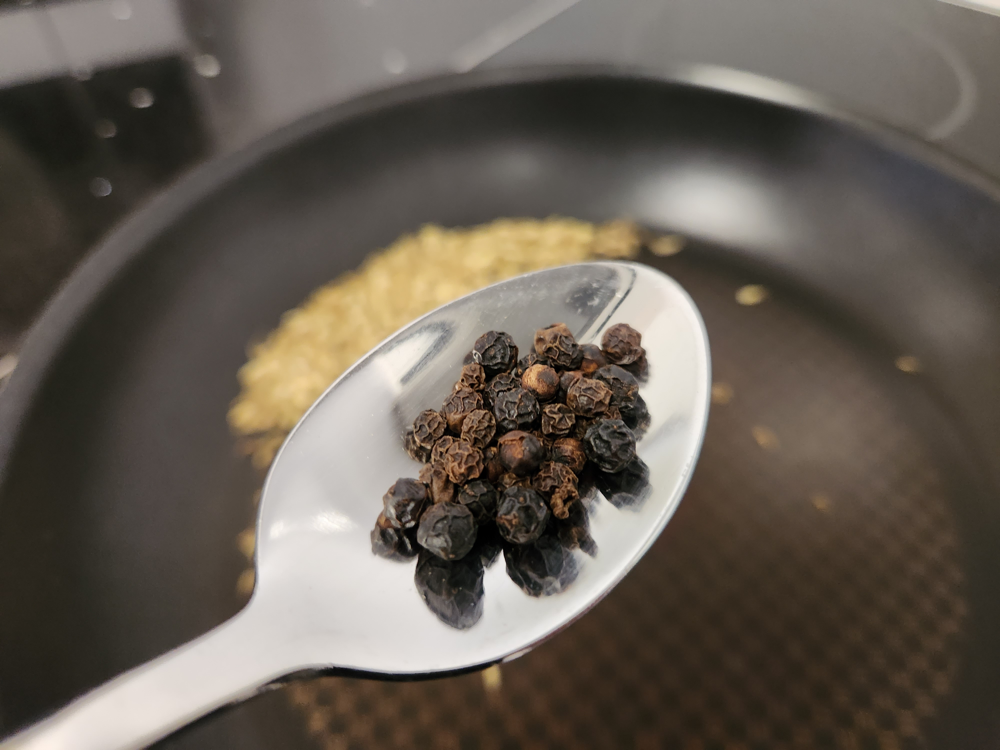
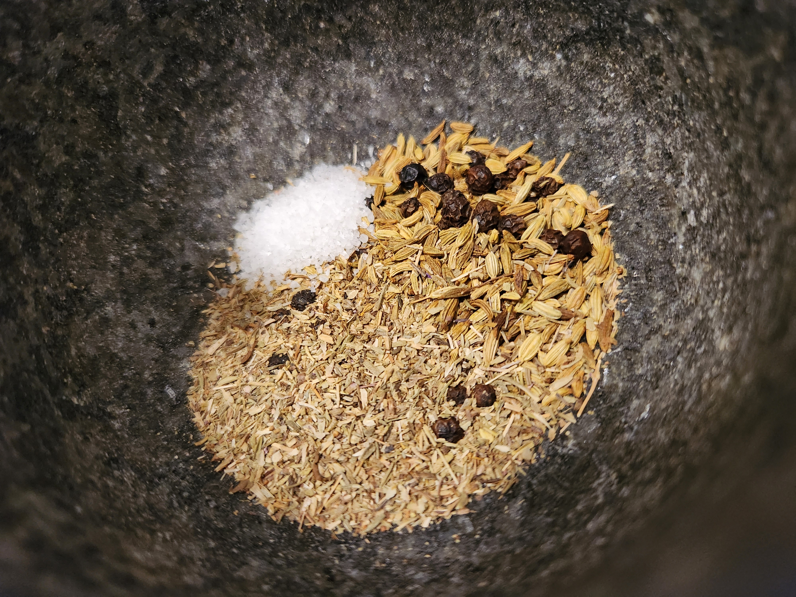
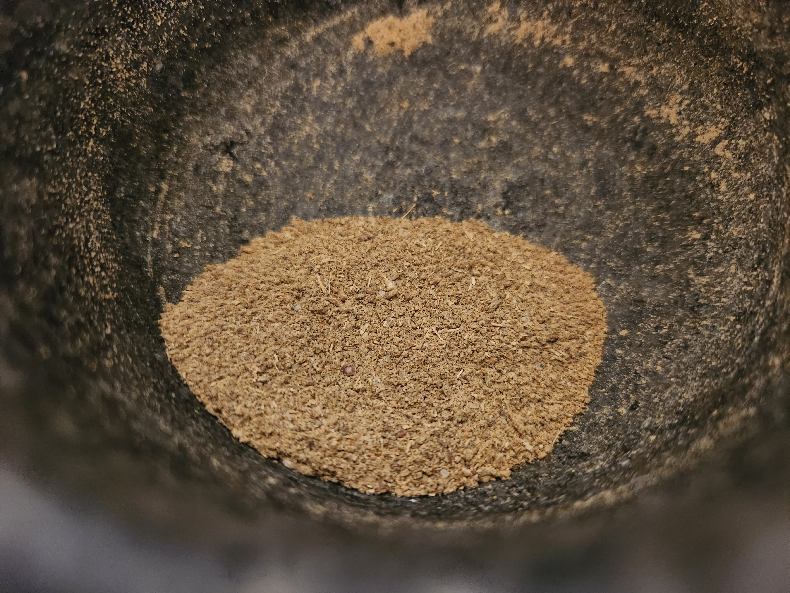
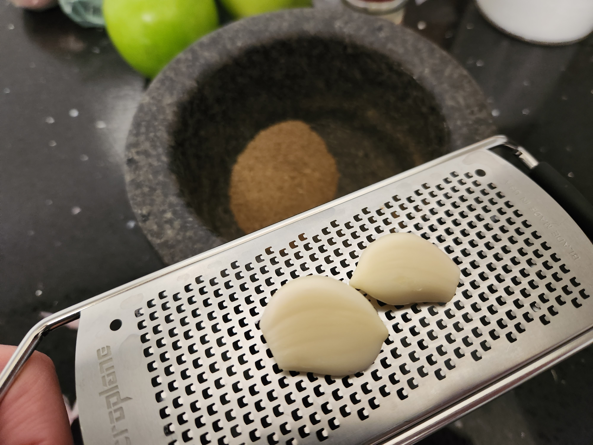
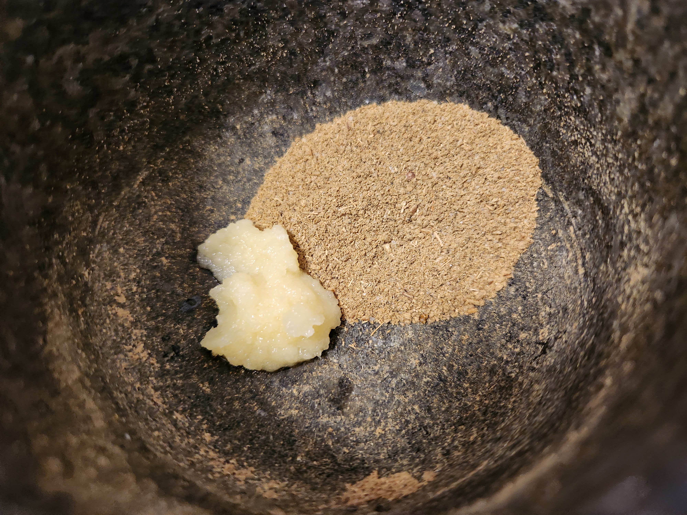
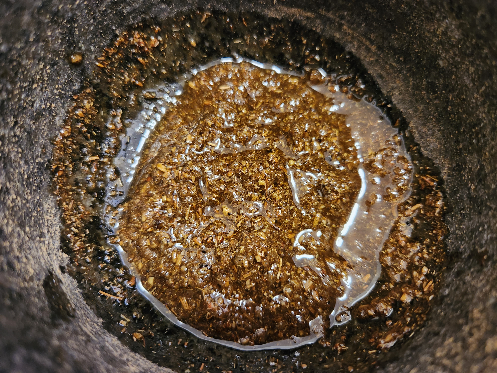
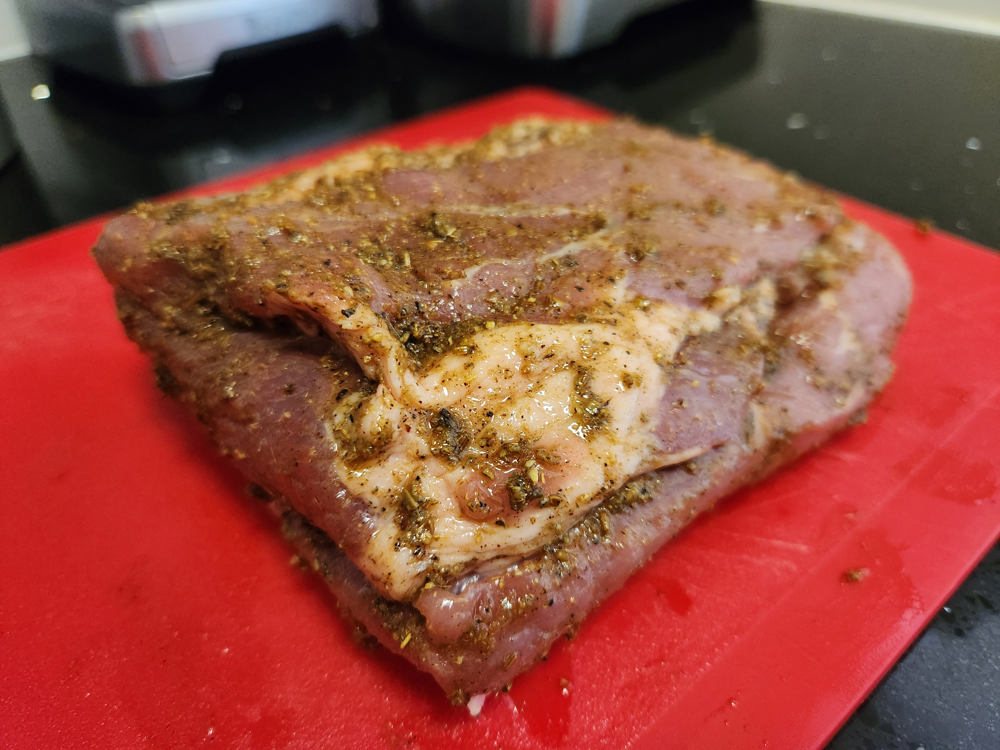
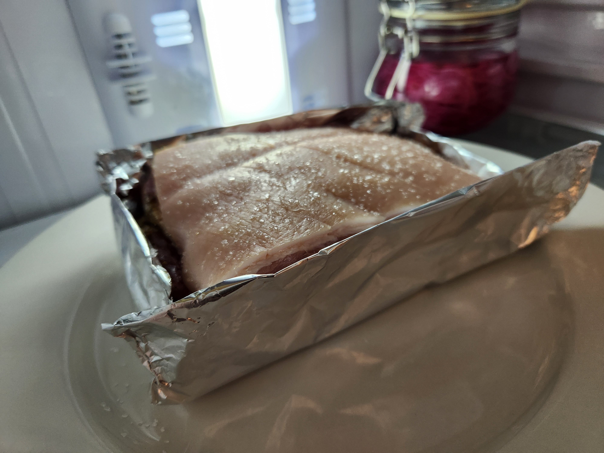
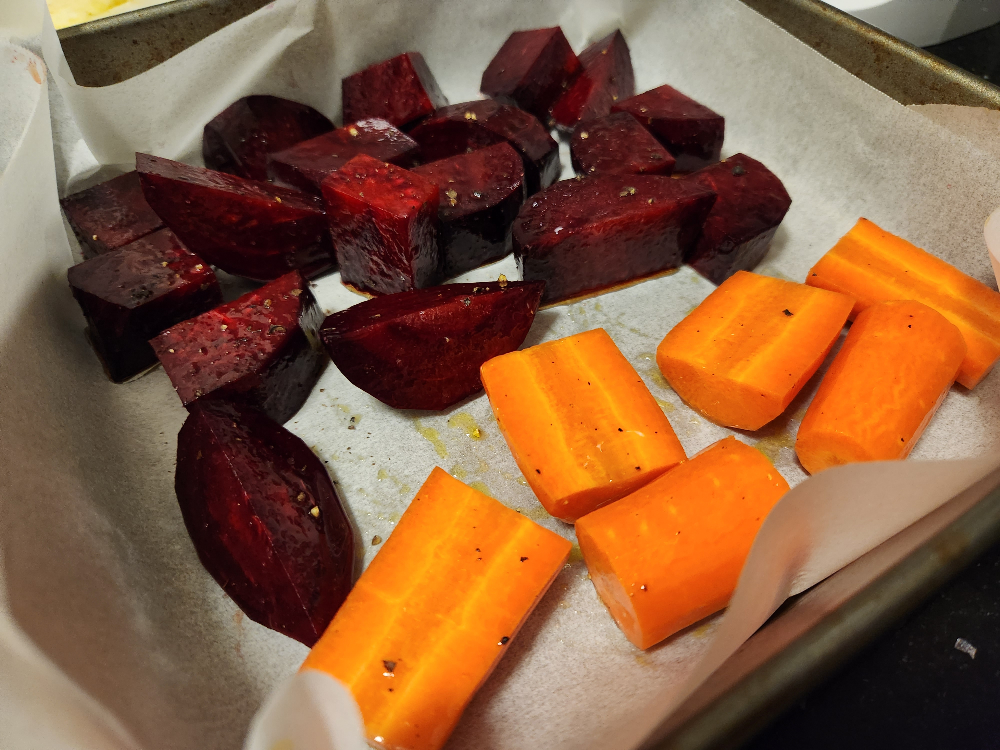

Toast the peppercorns and fennel seeds and grind up in the mortar and pestle along with salt and materfoods italian herbs. Once it's ground, microplane in garlic and mix together with olive oil.

Rub fennel/herb paste on the underside of the pork and pat dry the skin. Salt the skin and let it sit in the fridge so the skin drys out and the paste to penetrate the flesh.

>If you have time, check it after a few hours and pat the skin dry again if the salt has done it's thing.

Turn on the oven and while it's getting to temp, score the skin in 2-3mm strips or as best you can. When the oven it at temp pop in the pork (we're going to roast it for 30min on max).

While it's roasing cut up the veg and season ready to be put in the oven.

Apple Sauce -

Peel and slice apple and put into the pan on a medium heat. Microplane some orange and lemon zest onto the apple and add some sugar and cinnamon. Add some water if it's getting too dry and cook down.

Check on the pork & veg in the oven; see if you want to crank the heat up again to finish or use the broiler.

Once you're happy serve the pork + veg + apple sauce.

>Protip: when cutting the pork, place it skin side down and cut though the bottom down though to the skin


  
  
  
  
  
  
  
  
  
  
  


 
 


Next time you make this: 
- For the crackling, don't use the broiler. Turn the oven up to max first (apparently theres less moisture in the oven out the gate than turning it up as a finisher. t.Shannon Bennet) 
- 30min on max (turning halfway though) / 60min at 180degC with the veg / max again to "finish" [Note: last time the piece was ~2inch thick so thinner pieces will need less time right?] 
- Also more scoring and deeper. 2-3mm wide cuts lengthways ends up making the task of cutting up pieces while eating with a regular knife easier
