| Ingredient  | Amount |
| ----- | ---- |
| Chicken | 2 Merrylands |
| Potatoes | 2 |
| Carrots | 3 |
| Beetroot | 1 |
| Lemon | 1/2 |
| Rosemary | 2-3 sprigs |
| Thyme | 1 tsp |
| Butter | 1/2 tblsp |
| Salt | To taste |
| Pepper | To taste |
| Flour | ~2-3 tsps |
| Honey | to balance |
| Olive Oil | To coat |


  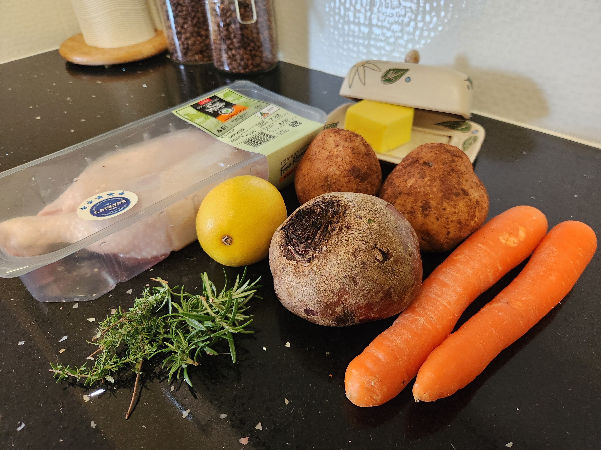


 

# Method

- Cut up the veg fairly chunky (we'll be roasting them for about an hour). Season with salt, pepper and olive oil. Put the veg on their own roasting tray. Preheat the oven to 220degC


  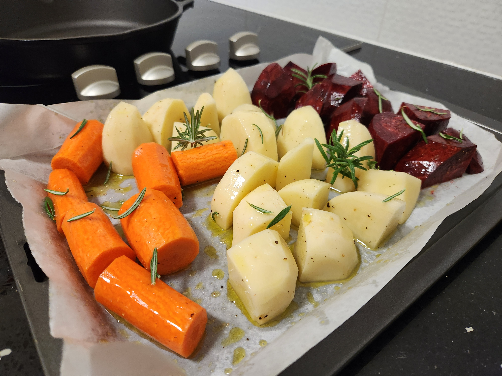

> Historically scattered rosemary on the veg. Not anymore. Updated photo inc.

- Make a compound butter with thyme and lemon zest

- Gently separate the skin from the chicken get the compound butter under the skin. Massage the butter though the skin to get an even distribution, get a bit of butter on the outside of the skin aswell. Salt the chicken skin and then place the merrylands in a cast iron pan.

> Don't fully detatch the skin from the merryland otherwise as it roasts the skin will shrink and expose the thigh. You wan't to keep the skin anchored and tight so it becomes crisp. 
> Use heat of the oven to soften the butter. Pop it in the fridge if it goes too far


  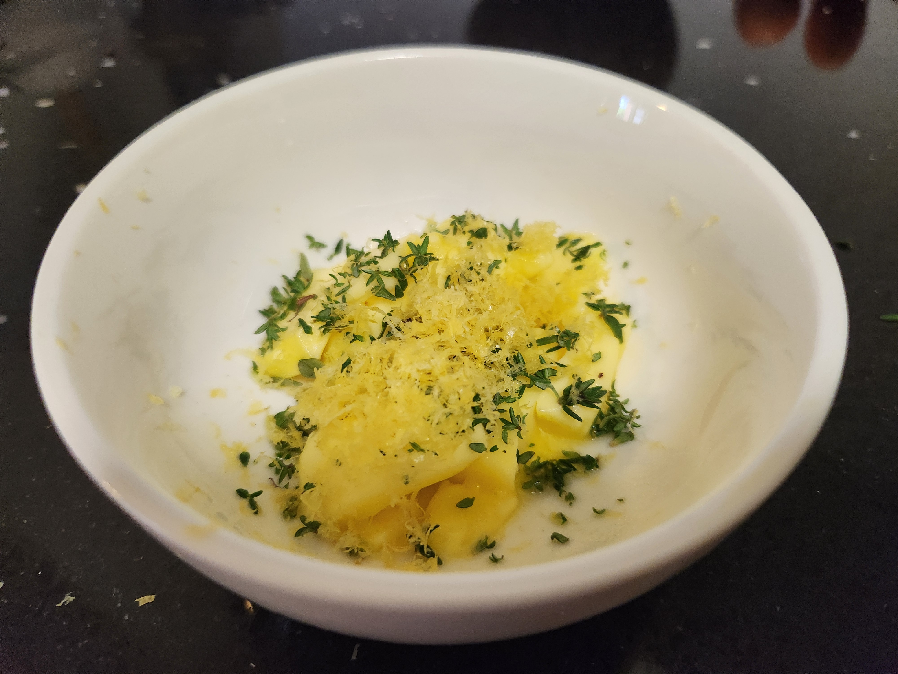
  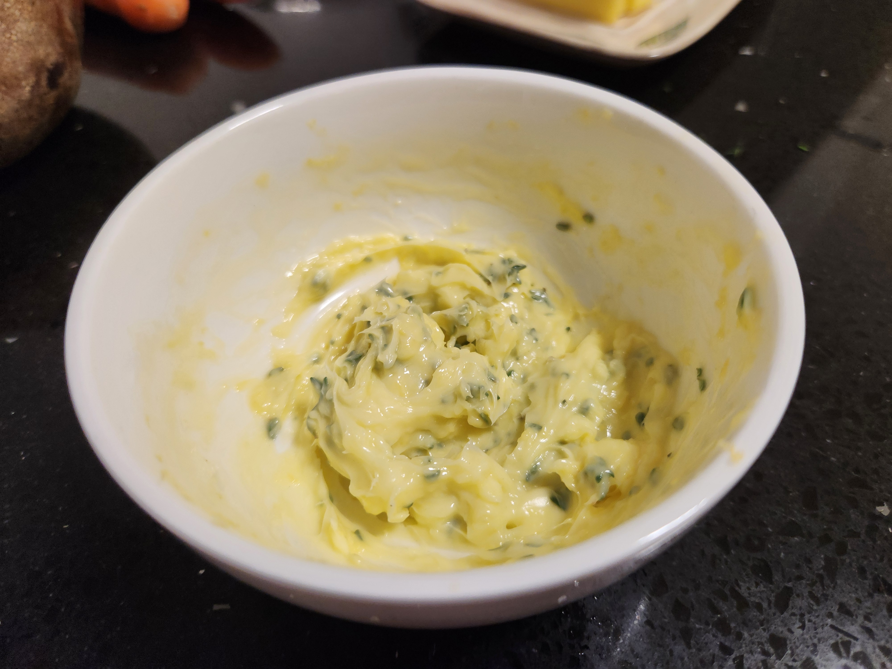
  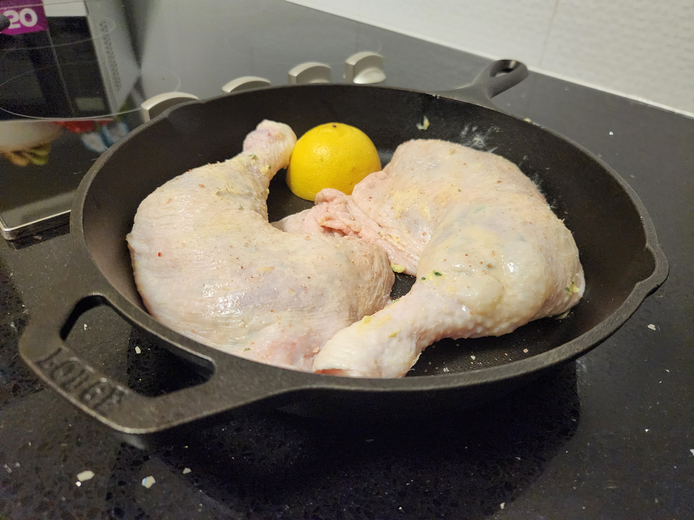


- Put the veg in first to get a head start on them

- After the veg has had 10mins, put the chicken in and roast for about 10mins at 220degC then turn down to 180degC to cook for a further 40-45min. Longer if the skin needs more time to brown.

> Baste the chicken at the temp change at 10mins in, again at 25mins and a final time at 35mins in. This will get the skin nice and crispy.  
> When basting for the last time at the 35min mark pop the rosemary in there as well to flavour the pan 

- After time, take the chicken out of the pan and put on a plate, let the heat out of the oven and rest the chicken (and the veg) in the warm oven. 


  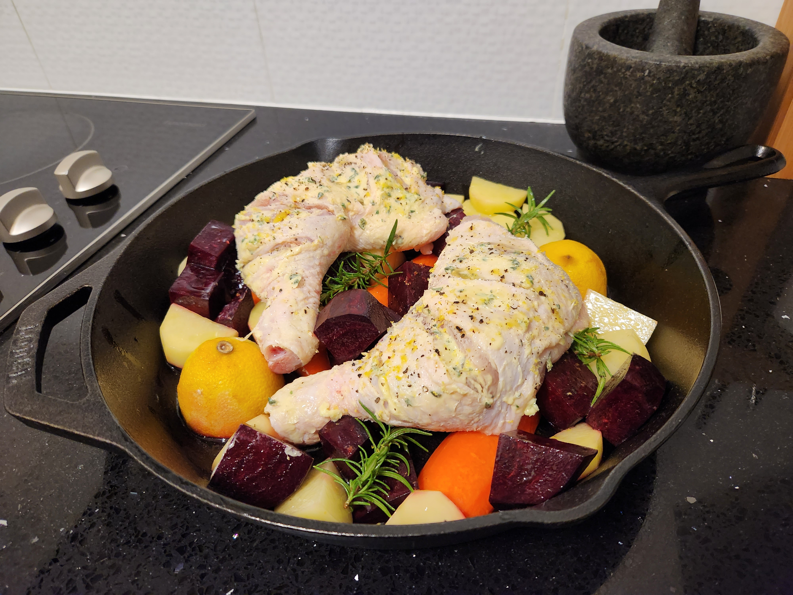


- Take the pan w/ drippings and make [mums gravy]().

> As the chicken rests it will release more juice which goes straight into the gravy pan. 

- Season the gravy with salt/pepper/honey/fresh lemon juice to balance. Consider cutting up some of the roasted rosemary in there to round it out (it's a lemon & herb gravy)


  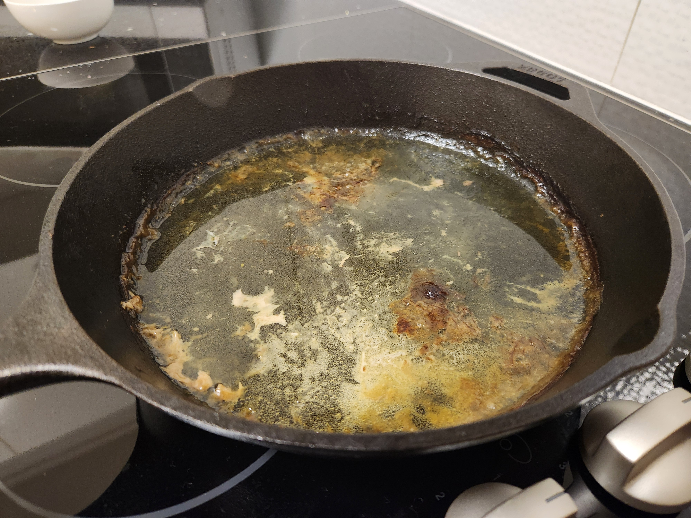
  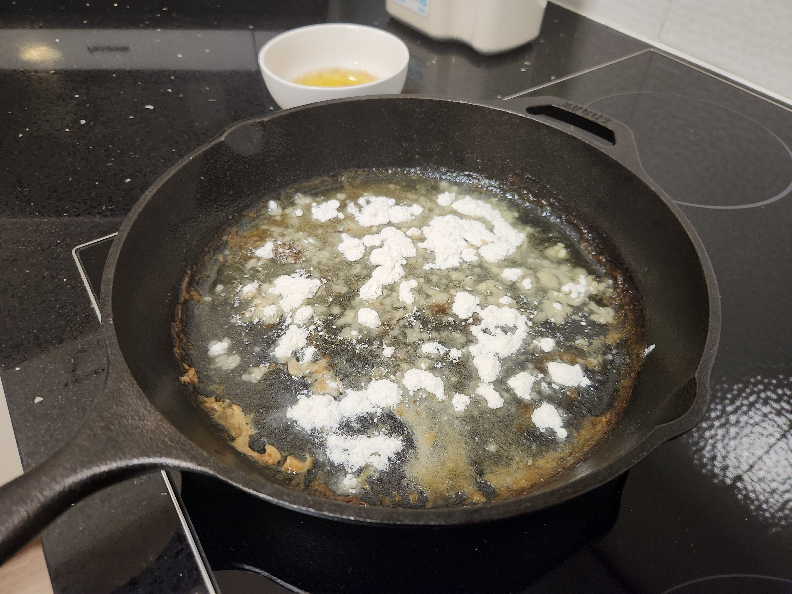
  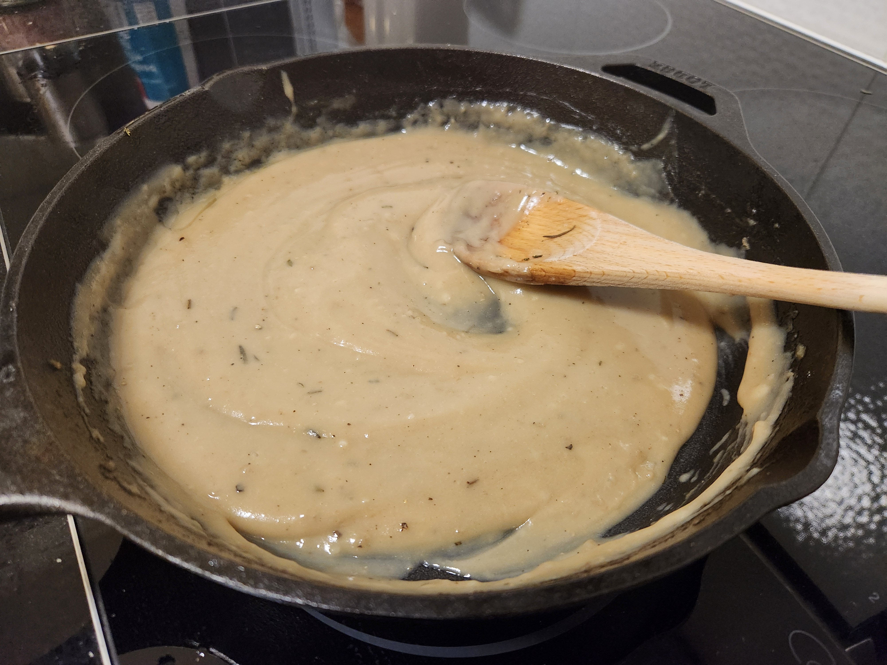


- Enjoy


  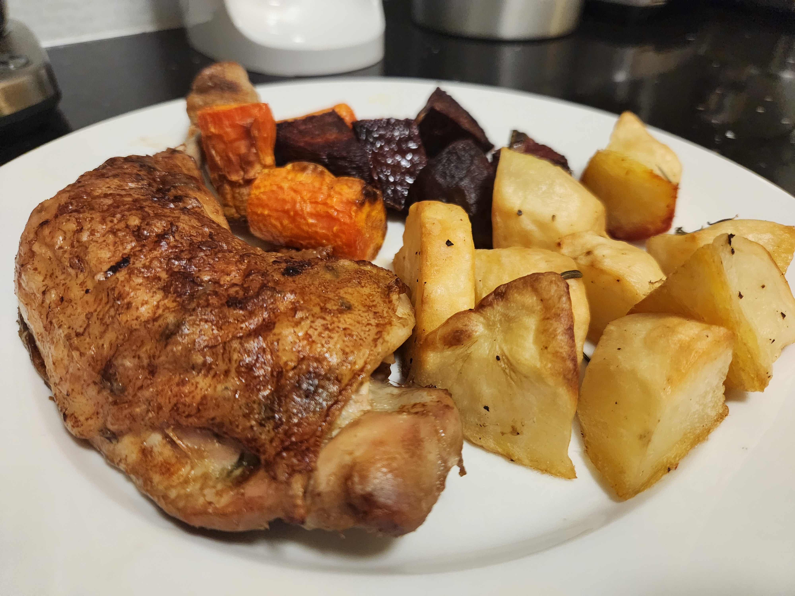
  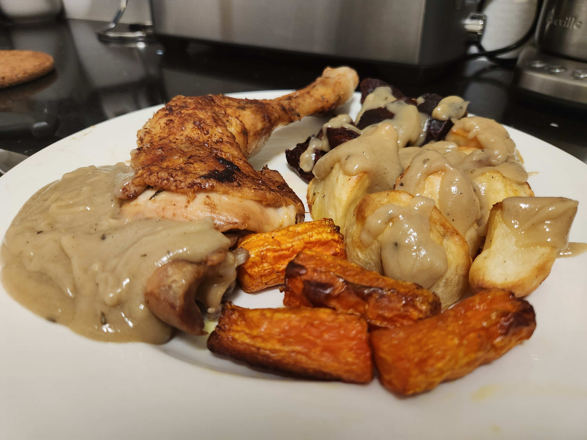


 


Next time: 
- When making the gravy try add as much flour as you need to absorb ~85% the juices and cook on hob 3 [or 4 taking it on and off as you need] for ~5mins. You want to see the flour "bubble". 
You'll use about a whole milk jug of warm water to get this all together. It will thicken as it cools so maybe see if you can make it "thin" so as it does cool it doesn't become a gel.
