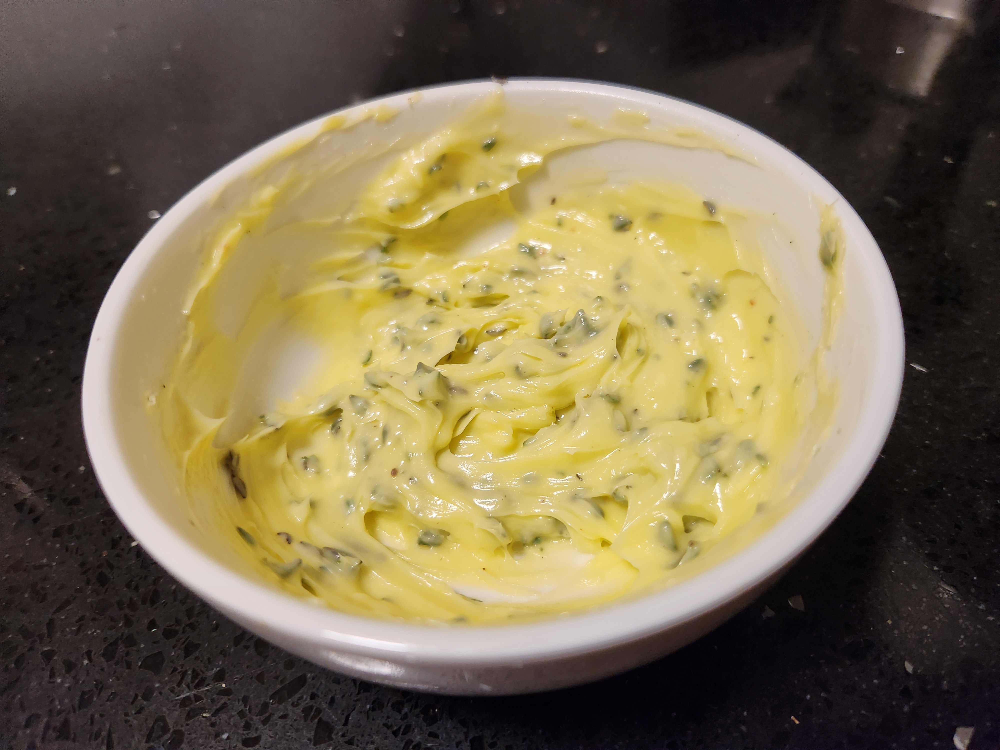
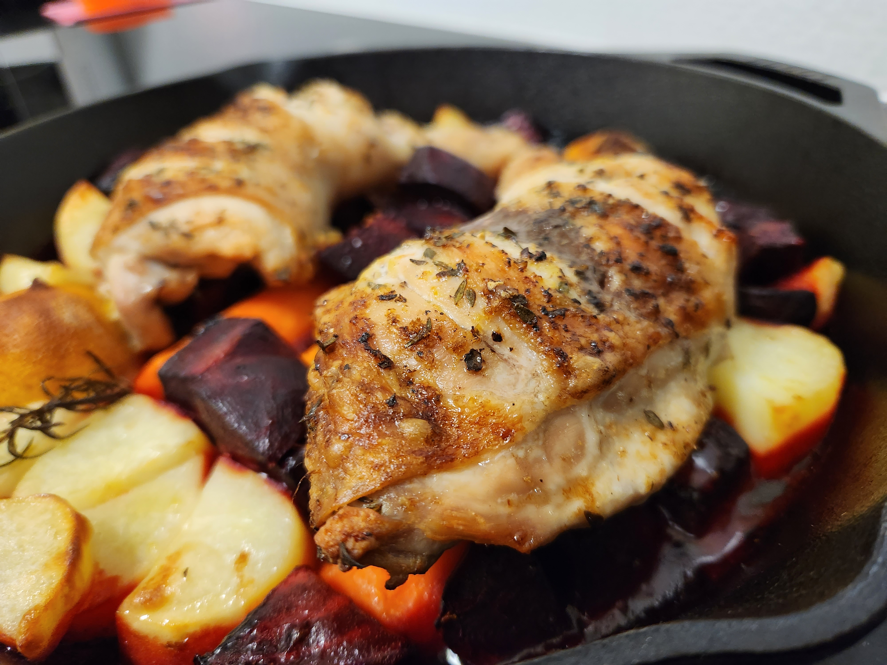

| Ingredient  | Amount |
| ----- | ---- |
| Chicken | 2 Merrylands |
| Potatoes | 2 |
| Carrots | 2 |
| Beetroot | 1 |
| Lemon | 1 |
| Rosemary | 2 sprigs |
| Thyme | 1 tsp |
| Butter | 1 tblsp |
| Salt | To taste |
| Pepper | To taste |
| Olive Oil | To coat |

# Method

- Cut up the veg. Salt + olive oil. Toss together with the rosemary sprigs. Put in the cast iron pan.


  


- Slash the chicken to the bone in a few areas, get tyme/butter under the skin. Massage leftover all over the chicken. Put ontop of the veg. Salt, pepper and microplane some lemon zest over the chicken, squeeze some juice over the skin and place the lemon face down on the pan.


  
  
  
  
  
  


- Roast at 180degC for 45min. Longer if needed or raise the temp if the skin needs to crisp.

- Take everything out of the pan (keep warm in the off oven) and squeeze the lemon in there. Add flour and water and cook to make [mums gravy]().


  
  
  


- Enjoy


Next time: 
- one lemon was too much. Do half (maybe not even put it in the pan face down and probably not squeeze the cooked lemon juice in the pan for the gravy)
- potatos cooked seprately so they're crisp
- splay the chicken skin as much as you can so it gets exposed and crisp all over
- keep the chicke on its own plate and drain the juices into the gravy (after its sat for abit)
- add salt/pepper/sugar to the gravy to balance
- maybe less butter (same ammout of herb)
- use heat of the oven to soften the butter. Pop it in the fridge if it goes too far
- 1 tblsp of flour, too much and it gets gluggy. Med heat for the gravy high was too much. Scrape the cast iron plan with the spoon to get all the goodness off and in the gravy
