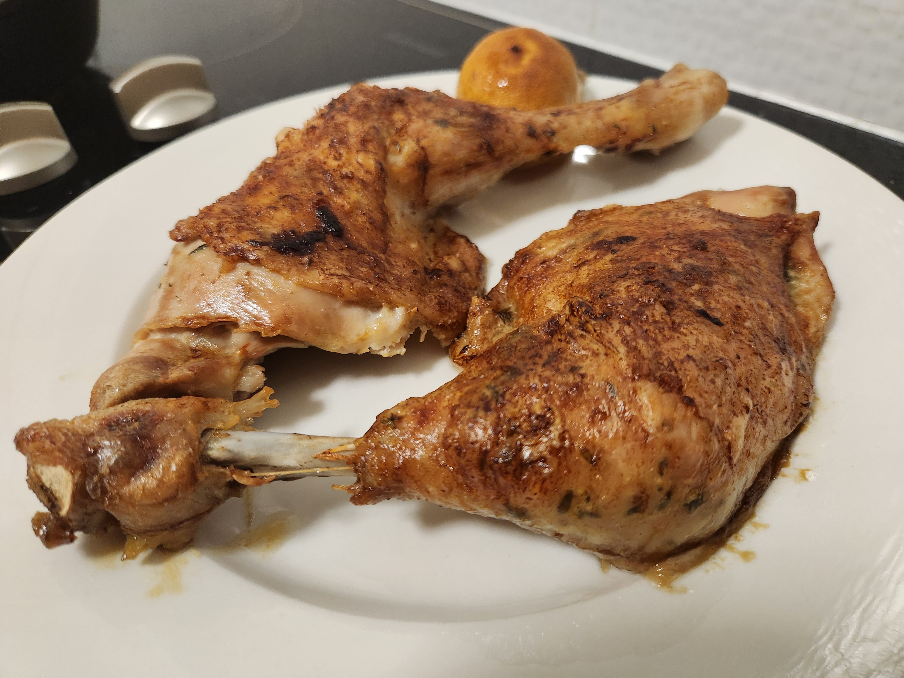

| Ingredient  | Amount |
| ----- | ---- |
| Chicken | 2 Merrylands |
| Potatoes | 2 |
| Carrots | 2 |
| Beetroot | 1 |
| Lemon | 1/2 |
| Rosemary | 2-3 sprigs |
| Thyme | 1 tsp |
| Butter | 1/2 tblsp |
| Salt | To taste |
| Pepper | To taste |
| Olive Oil | To coat |

# Method

- Cut up the veg. Salt + olive oil. Toss together with some chopped rosemary. Put them on their own roasting tray.


  


- Make a compound butter with tyme and lemon zest

- Slash the chicken to the bone in a few areas, get the compound butter under the skin. Massage leftover all over the chicken and place in the cast iron pan along with a few sprigs of rosemary. Salt, pepper and microplane some lemon zest over the chicken and place the lemon face down in the pan.

> Use heat of the oven to soften the butter. Pop it in the fridge if it goes too far


  
  
  
  
  
  


- Roast at 220degC for about 10mins then turn down to 180degC for a further 45min. Longer if needed or raise the temp again if the skin needs to crisp further.

> Baste the chicken halfway through the cook and again towards the end.

- Take the chicken out of the pan and put on a plate (keep warm in the off oven). Add flour and water and cook to make [mums gravy]().

> As the chicken rests it will release more juice which goes straight into the gravy pan. 

- Finish the gravy off with salt/pepper/sugar to balance

> Optional: Squeeze an ammount of juice from the roasted lemon into the gravy to your liking.


  
  
  


- Enjoy


Next time: 
- Make a note of how the lemon is used
- splay the chicken skin as much as you can so it gets exposed and crisp all over
- start off with 1 tblsp of flour, too much and it gets gluggy. Med heat for the gravy high was too much. Scrape the cast iron plan with the spoon to get all the goodness off and in the gravy
- butter reduced from 1 to 1/2 tblsp. Too much butter means more flour to make the gravy. 
- consider microplaning some garlic to the butter
