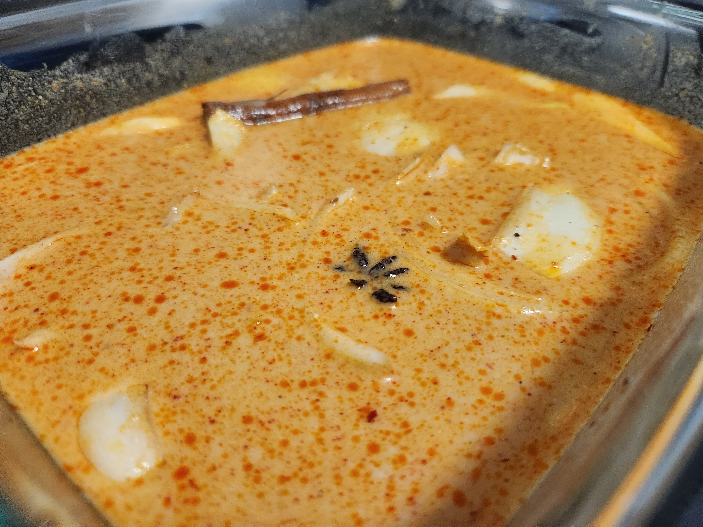
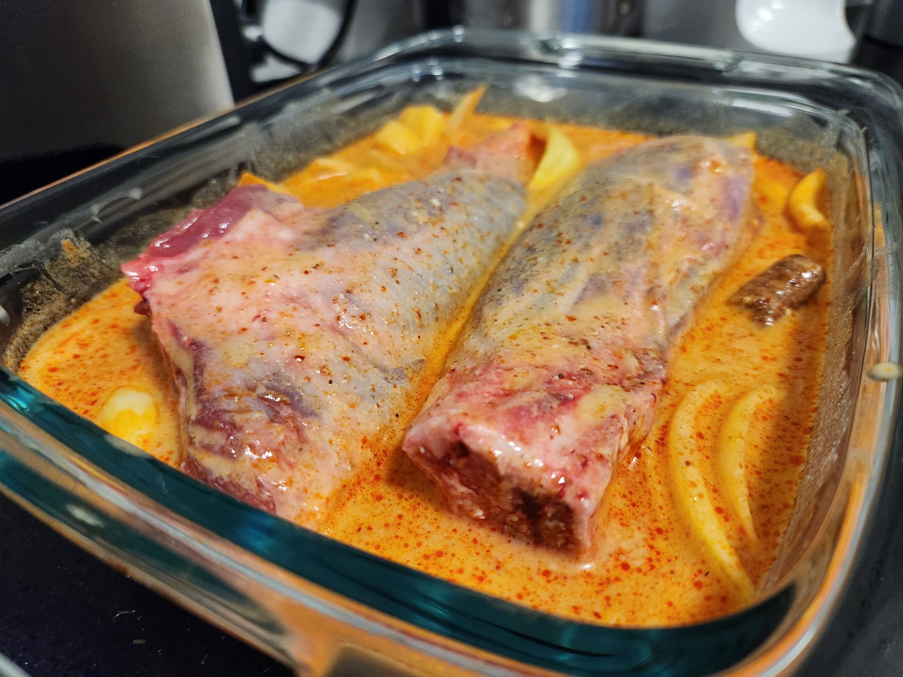
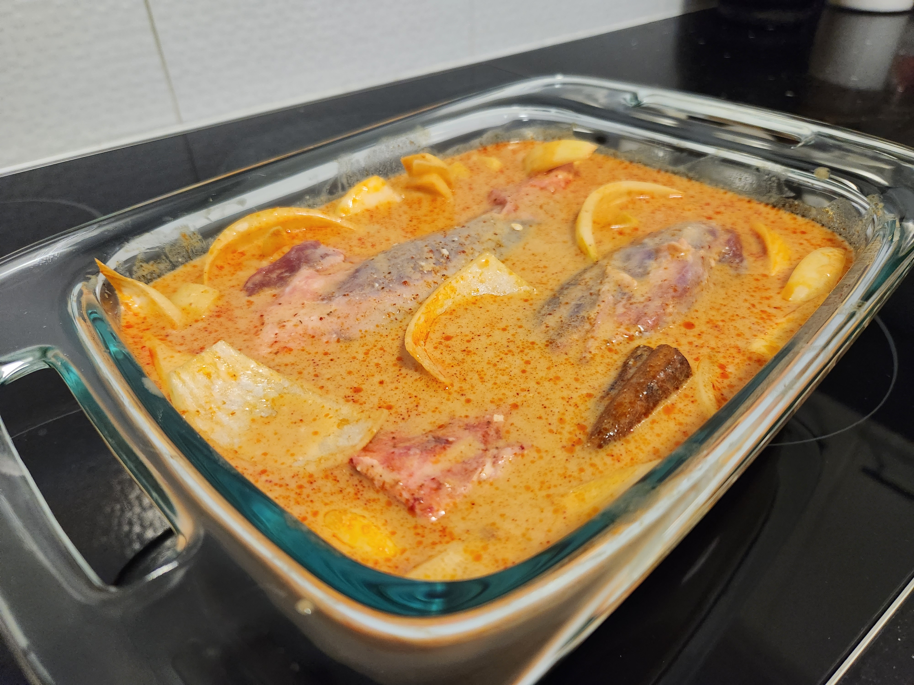
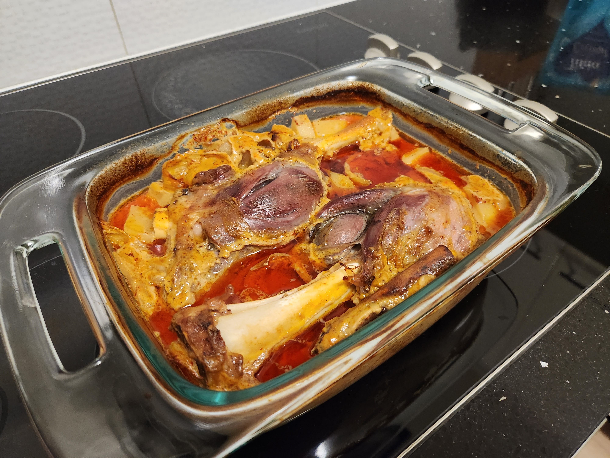
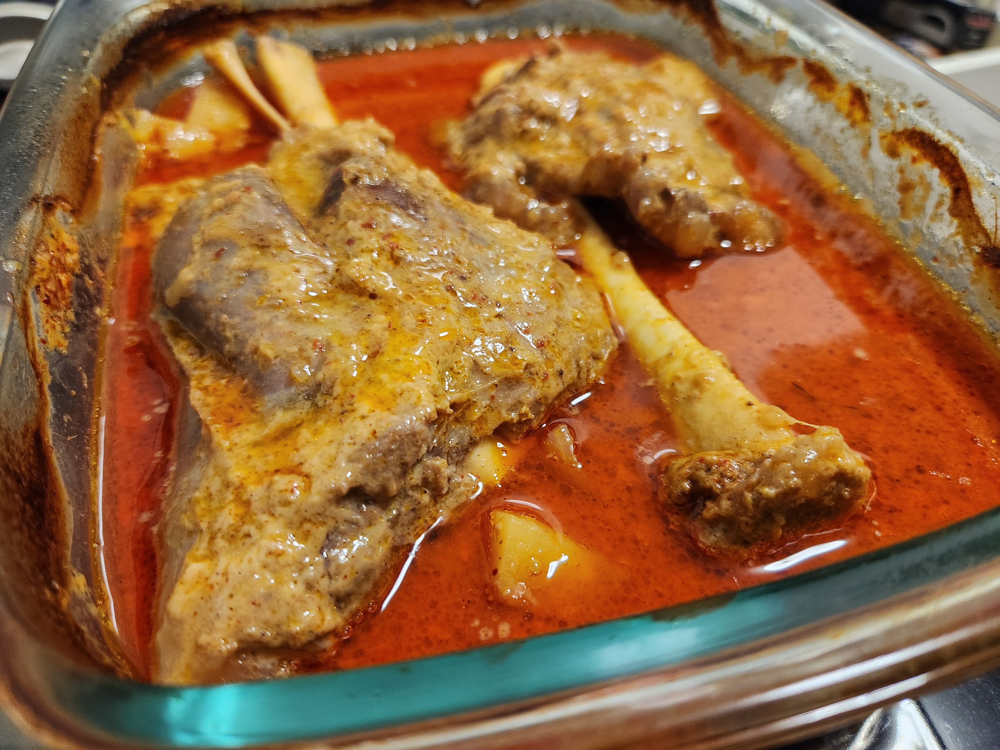
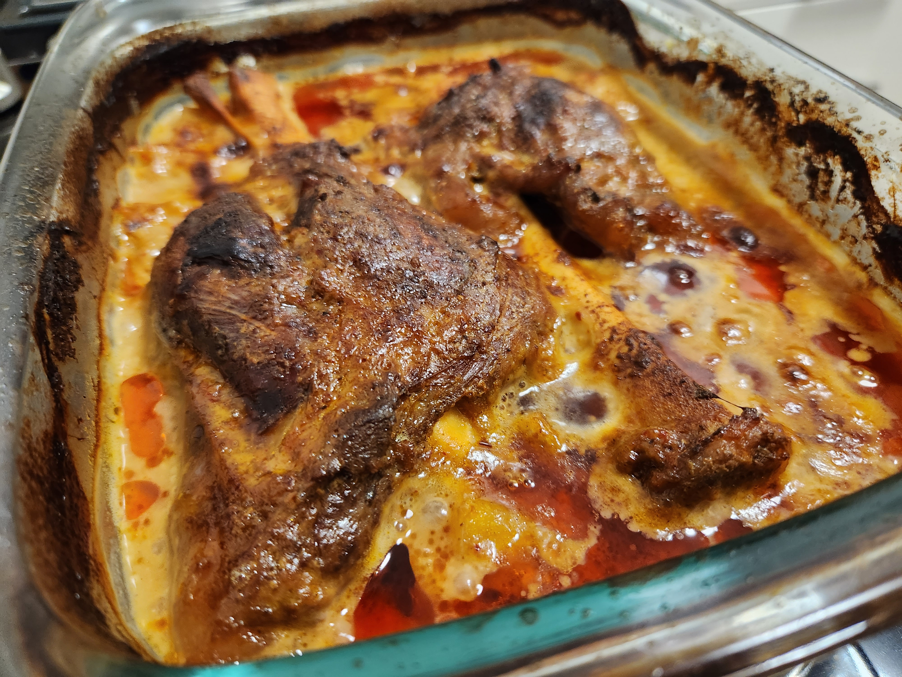

| Ingredient  | Amount |
| ----- | ---- |
| Lamb Shank | 2 |
| Curry Paste | [1/2 can](gallery/Maesri_Paste.jpg) |
| Potato | 1 red |
| Onion | 1/2 |
| Coconut Milk | 270ml |
| Chicken Stock | 1 cup (low salt) |
| Cinnamon Stick | 1 |
| Star anise | 1 |
| Rice | to serve |
| Veg | to serve |
| Corriander | to serve |

## Method

- Pre heat the oven to 160degC

- Cut up the onion into petals and potato into large chunks. Put them into a baking dish and add the stock, coconut milk, cinnamon stick, star anise and half of a can of the paste and mix all together. Press the lamb shanks in displacing the potato and onion so they're covered as much as the liquid will allow; coat with sauce and cover with a lid or foil.

>Put the tin of coconut milk under the tap to get it all out. The extra water will give more time to cook uncovered later.


  
  
  


- Put the dish in the oven to cook for 2 hours. After this time has passed remove the lid and turn the shanks and coat with the sauce. Continue to cook for a further 1hr.

>With the lid off the sauce will reduce and the exposed shanks will bake so turn them every 20-30min so they get colour on all sides. Add more water if it's getting too low (dropping below half the height of the shank).


  
  
  


- Prepare the veg and rice and once the shanks have had enough time, remove and set aside to be pulled. Skim and discard most of the oil off the top of the sauce and then remix.

>You want some oil for flavour but too much will make the whole meal feel greasy.

- Steam the veg and cook the rice. Pull the meat off the shank and start building the bowl with everything else. Top with freshly chopped corriander.
