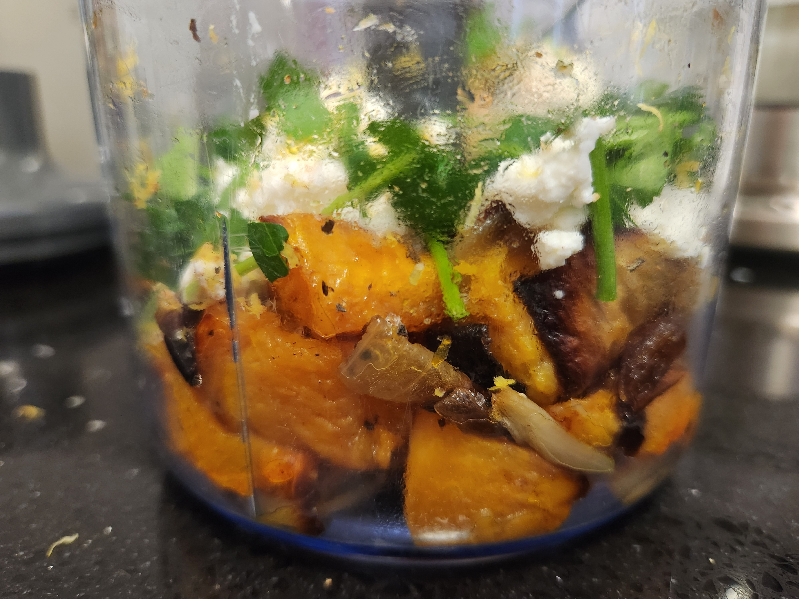
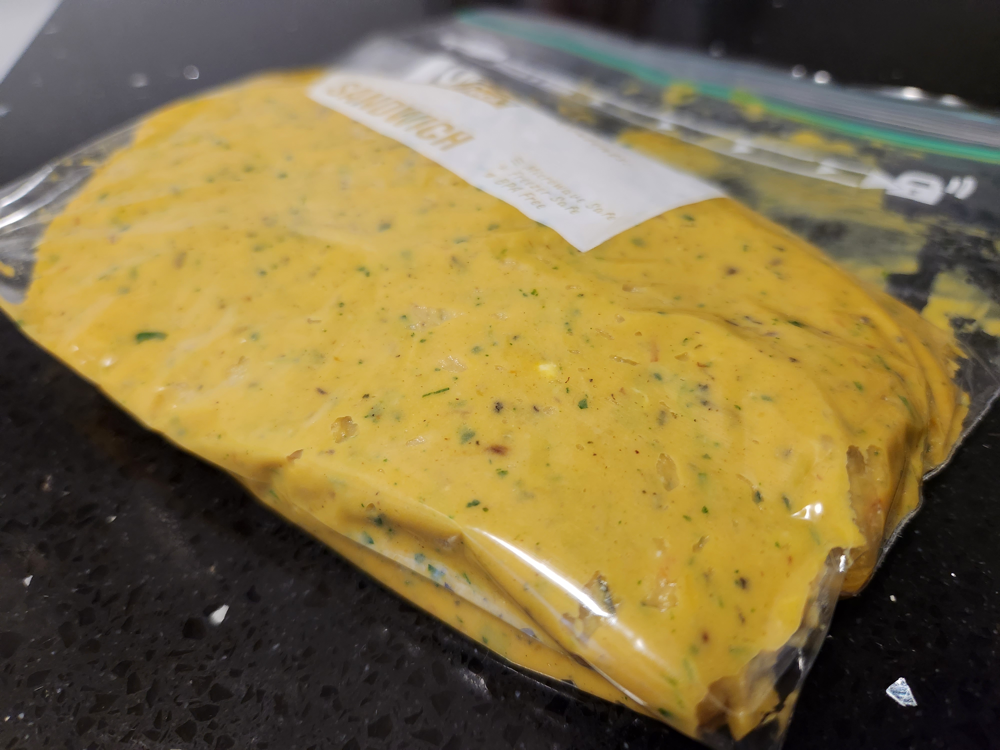
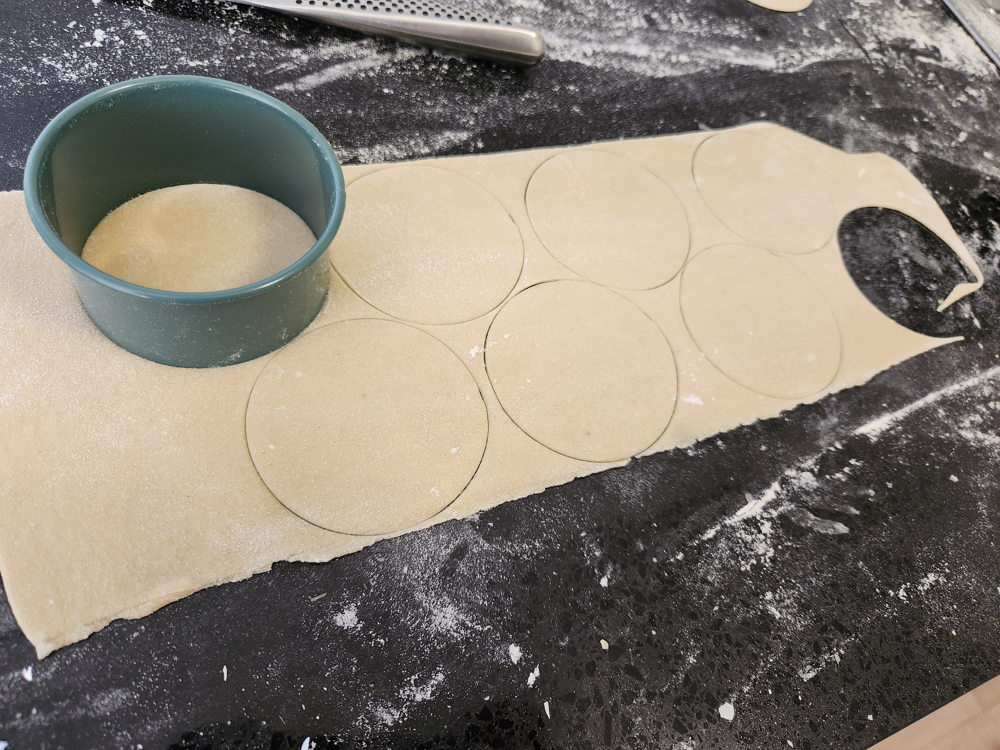
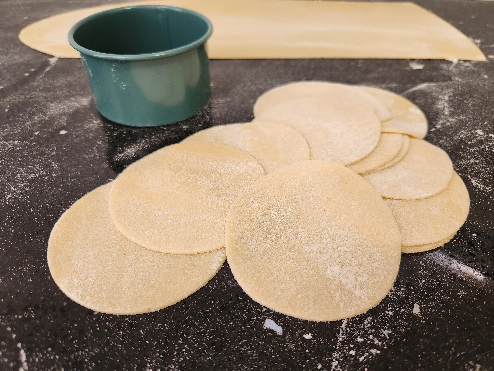
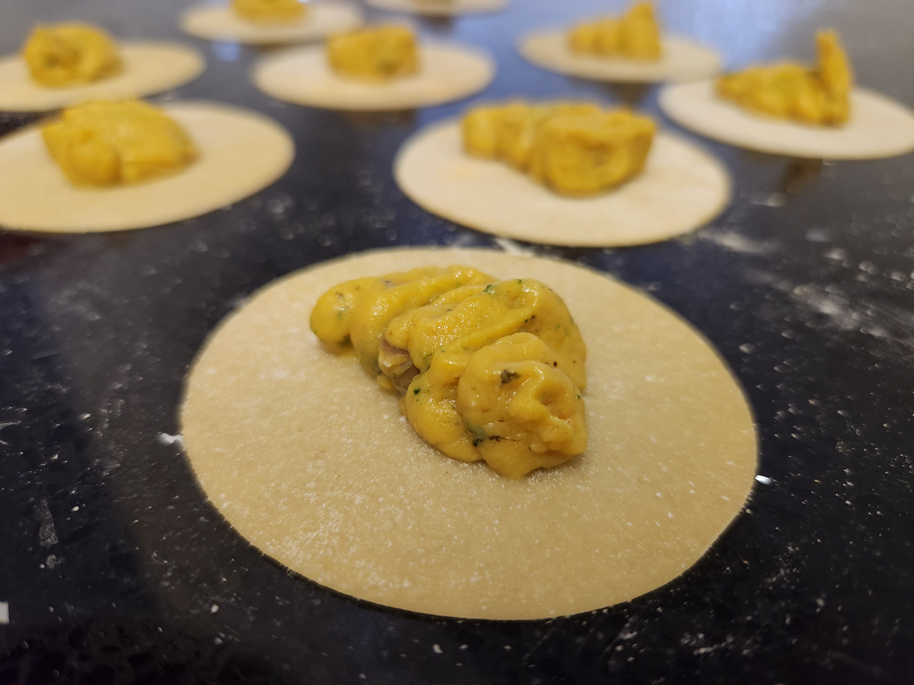
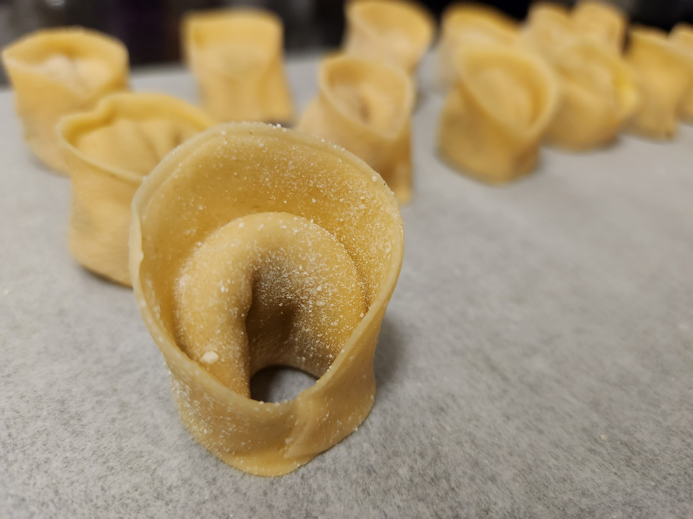
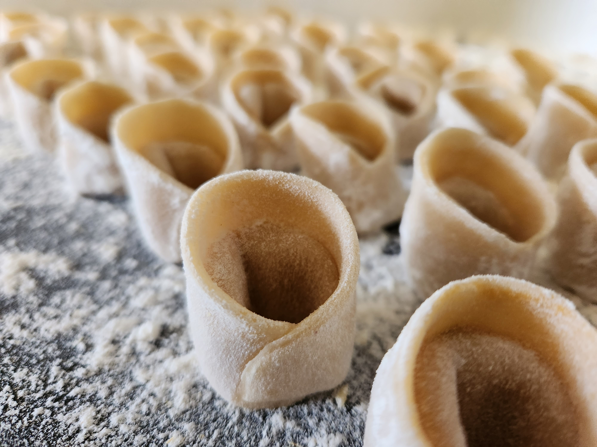
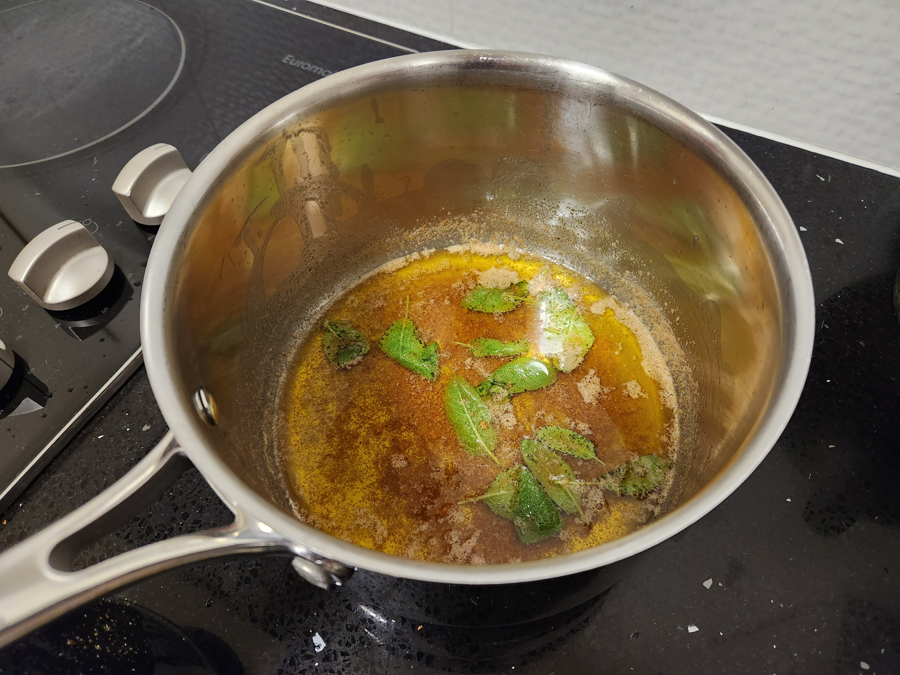

| Ingredient  | Amount |
| ----- | ----- | 
| Pasta   | [Fresh]()  |
| Butternut Pumpkin | just under 1/2 |
| Garlic | 1/2 a head |
| Onion | 1/2 |
| Ricotta  | to smooth the mix |
| Nutmeg  | to taste |
| Pecorino | ~50g |
| Butter  | ~100g |
| Sage  | handful |
| Lemon  | 1/2 |
| Parmisan | to finish |

[Fresh Pasta]() is a must for this recipe and you'll get ~16 tortellini per person when making the pasta dough. The ingredient ammounts listed above makes enough of the filling for two. Also, a [Pangritata]() is an easy addition to finish the dish if you've got a loaf on hand.

## Method

1. Cut up pumpin into 3cm chunks, break down the onion and add half the sage. Coat in oil, salt, peper and nutmeg. Wrap up the garlic bulb in foil and drizzle with olive oil and salt. Place everything on a tray lined with baking paper and roast in the oven at 200degC for about 45 mins.


  


>ProTip: Turn the veg over after ~20min to get all sides caramalised. Remove the onion early if it's done, don't let it burn.

2. While the pumpin is roasting make a batch of [Fresh Pasta]() and leave to rest.

3. Once the veg is done, let it cool slightly before blending in a food processor. Add enough ricotta to smooth it out for a nice mouthfeel; peccorino for funk and if warranted some lemon zest for some brightness. Mix together and place in a "piping bag".


  
  
  


4. Portion and roll out the pasta dough passing 3 times on each thickness upto 4 and then one final pass on thickness 5. Try to make the pasta sheets wide when bookfolding so there's less wastage when cutting out disks with the 7cm diameter cutter (3rd smallest).

5. Pipe the pumpkin mix into the centre of the pasta disks, wet around the edges and seal by pressing the edges together. Try to make the newly created double layers a little thinner so cooking the tortellini al dente is easier. Wrap the pasta around your little finger and wet one wing and press the other into it. Set aside.


  
  
  


>ProTip: Use some folded up paper towel to wet the edges. It's better than using a wet finger which you want to keep your hands dry while handling the pasta.


  
  
  


6. When you're ready put on a pot of salted water for the pasta and a saucepan on medium for the burned butter sauce. Once the butter is melted tear up a few sage leaves and add them in. Keep cooking the butter on a medium heat swishing it around to keep an eye on it so it doesn't burn. Once the milk solids are golden add a few good squeezes of a lemon to stop the process, mix together and set aside.


  
  


7. Cook the pasta, drain and then coat in the burned butter & sage sauce.

8. Top with parmisan cheese and serve


 

Next time you make this: 
Remove Onion. It doesn't blend well and chokes up the piping bag. 
See how 1/2 a garlic goes. 1 head is proably too much. 
Add some parmisan to the mix alongside the pecorino 
Pay attention to the lemon zest. Does is really need it? 


