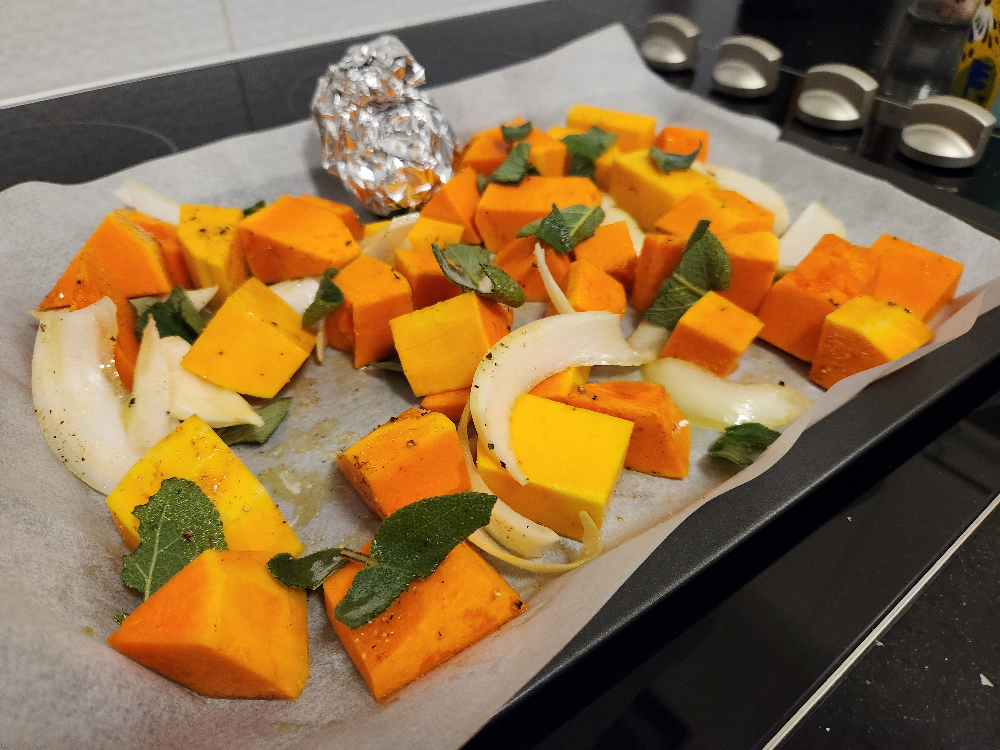

| Ingredient  | Amount |
| ----- | ----- | 
| Pasta   | [Fresh]()  |
| Butternut Pumpkin | just under 1/2 |
| Ricotta  | to smooth the mix |
| Nutmeg  | to taste |
| Garlic | 1/2 - 1 head |
| Onion | 1/2 |
| Pecorino | ~50g |
| Parmisan | to finish |
| Butter  | ~100g |
| Sage  | 1 punnet |
| Lemon  | 1/2 |

[Fresh Pasta]() is a must for this recipe. Also, a [Pangritata]() is an easy addition to finish the dish if you've got a loaf on hand.

## Method

1. Cut up pumpin into ~2-3cm chunks, break down the onion and add half the sage. Coat in oil, salt, peper and nutmeg. Wrap up the garlic bulb in foil and drizzle with olive oil and salt. Place everything on a tray lined with baking paper and roast in the oven at 200degC. About 45 mins.


  


>ProTip: Turn the veg over after ~20min to get all sides caramalised. Remove the onion early if it's done, don't let it burn.

2. While the pumpin is roasting make a batch of [Fresh Pasta]() and leave to rest.

3. Once the veg is done, let it cool before blending in a food processor. Add enough ricotta to smooth it out for a nice mouthfeel; some lemon zest for some brightness and peccorino for funk. Mix together and place in a "piping bag".


  
  
  


4. Roll out the pasta passing 3 times on each thickness upto 4 and then one final pass on thickness 5. Try to make the pasta sheets wide when bookfolding so there's less wastage when cutting out disks with the 7cm diameter cutter (3rd smallest).

5. Pipe the pumpkin mix into the centre of the pasta disks, wet around the edges with a paper towel, seal the pasta and press the edges trying to make the newly created double layers a little thinner so cooking the tortellini dente is easier. Wrap the pasta around your little finger and wet one wing and press the other into it. Set aside.


  
  
  


>ProTip: Paper towel can be squeezed so its damp, way better than using a wet finger which you want to keep your hands dry for sealing


  
  
  


6. Put a pot of water on to boil in preperation for the pasta when the burned butter sauce is ready. Add butter to a medium heat saucepan. After a few minutes tear up the rest of the sage and add. Keep cooking the butter on a medium heat swishing it around keeping an eye on it. Once the milk solids are caramlised, a few squeezes of a lemon to stop the process and bring it all together.


  
  


7. Cook the pasta, drain and then coat in the burned butter & sage sauce.

8. Top with parmisan cheese and serve

