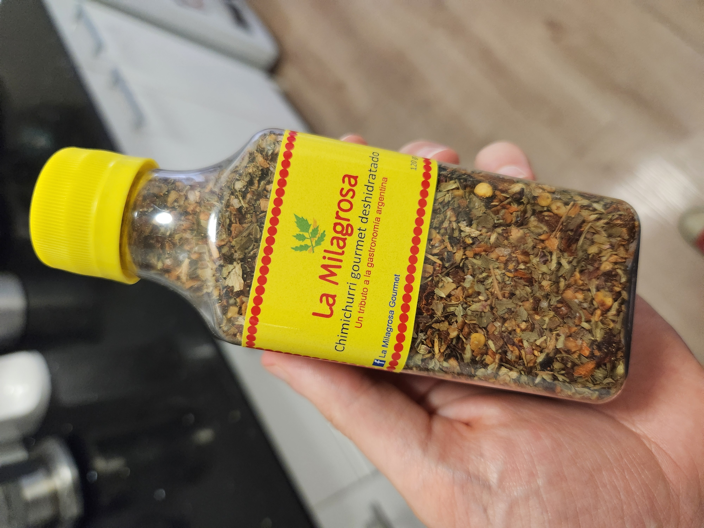
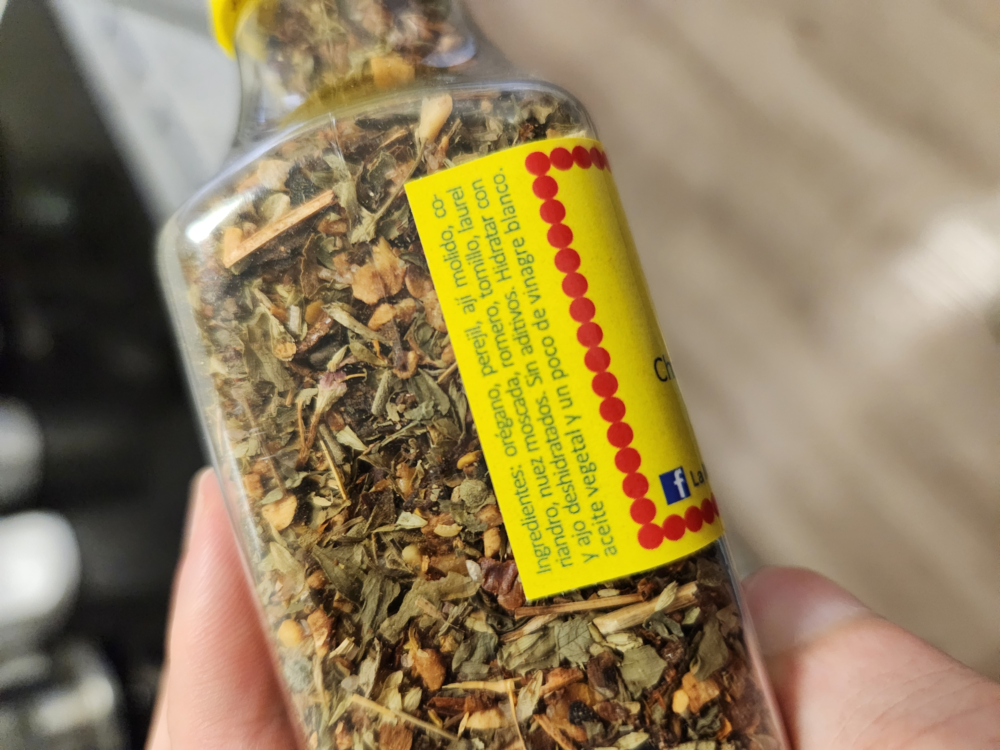

| Ingredient  | Amount |
| ----- | ---- |
| Oregano | 1 bunch |
| Parsley | 1 fistful |
| Chili | 1 |
| Corriander Seed | 1-2 teaspoons |
| Nutmeg | ? |
| Rosemary | ? |
| Thyme | few sprigs |
| Bay Leaf | 1 |
| Garlic | 2 cloves |
| Olive Oil | 3 glugs |
| White Vinegar | dash |

# Method

This mirrors what I got at a market stall in Argentina however I'll leave out the rosemary and nutmeg.

Cut all the herbs down really fine (especially any stalks)

Crush the bay leaf. Don't cut it up.

Toast the corrander seeds and grind them in a mortar & pestle.

Mix all together with oil and add a dash of vinegar to give it some life.

 


  
  
