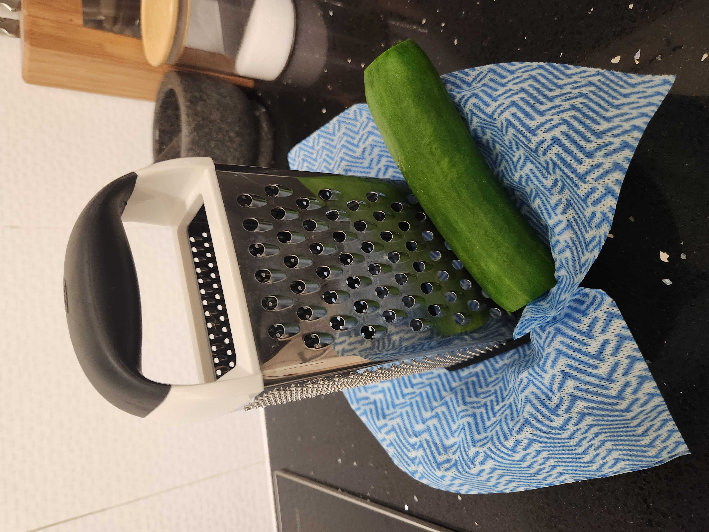
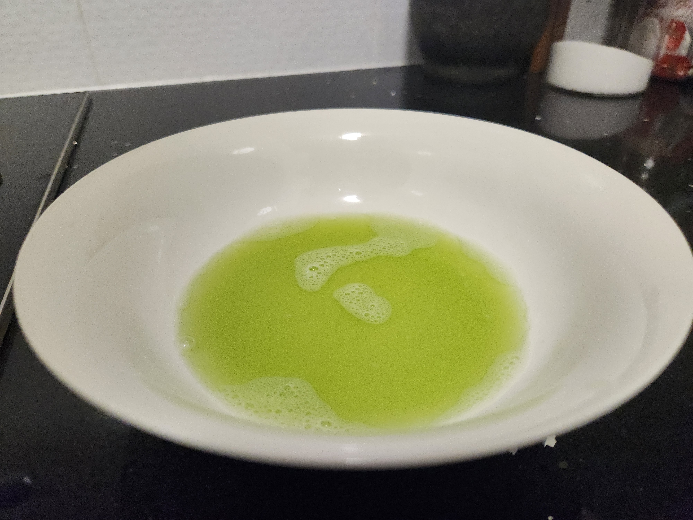
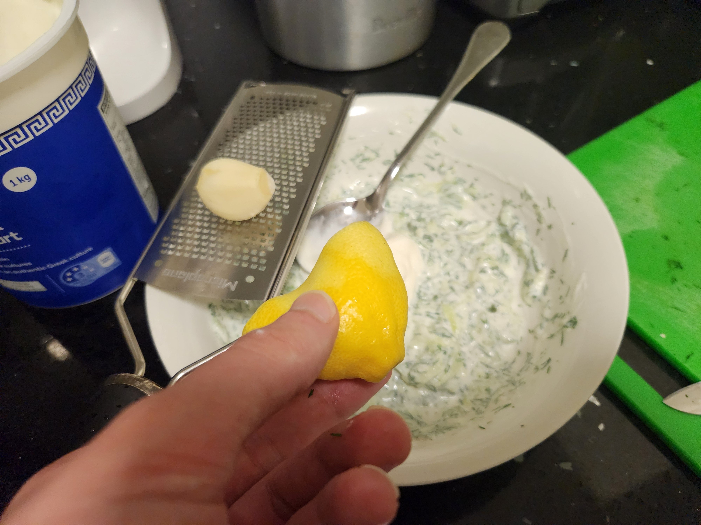

| Ingredient  | Amount |
| ----- | ---- |
| Yoghurt | ~1 cup |
| Cucumber | 1 |
| Garlic | 1 clove |
| Dill | 3 tablespoons |
| Lemon | 1/2 |
| Salt | to taste |

# Method

Grate the cuccumber on a box grater (largest) over a bowl lined with a disposable cloth. Squeeze out the liquid.

Add everything in a bowl together and taste. Add more to achieve the balance you're after.

>Cucumber liquid can be saved to make a gin and tonic

 


  
  
  
