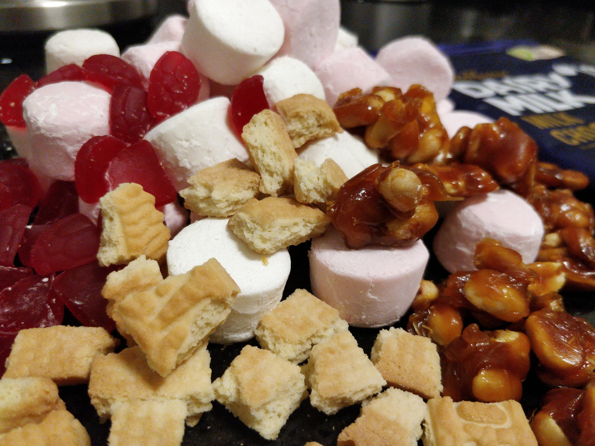
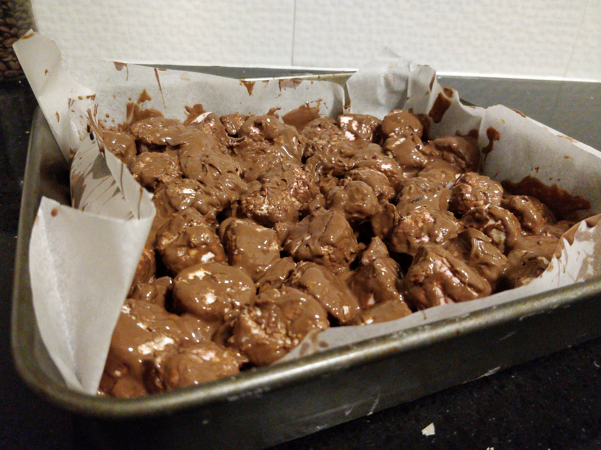

| Ingredient  | Amount |
| ----- | ---- |
| Chocolate | 2-3 blocks |
| Marshmellows | Jumbo Pack (520g) |
| Red Rasberries | 1 bag |
| Arnott's Scotch Finger Biscuits | ~6 biccies |
| Salted Caramel & Peanut |  |

## Method

Make a caramel thats more gooey than brittle (cream & soft ball sugar mix [112degC?]) and mix peanuts into the caramel and set aside.

Melt the chocolate over a simmering saucepan and cut up and break up all the bits to more managable pieces.

Mix all the chocolate together with the rest of the ingredients and set aside in the fridge to set.


  
  
